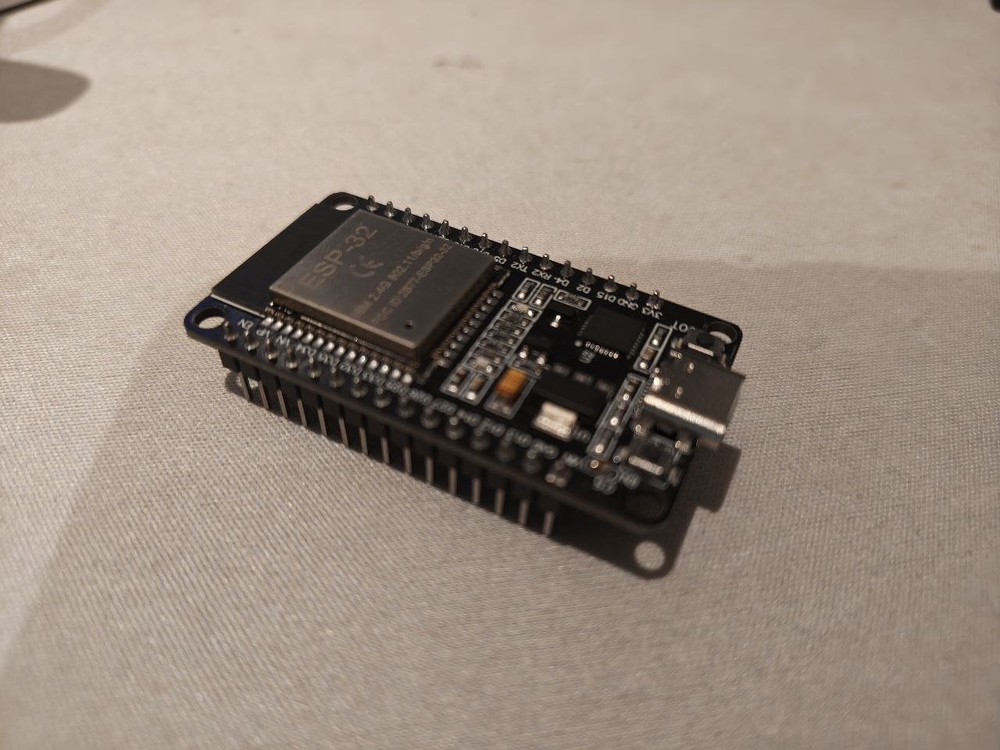
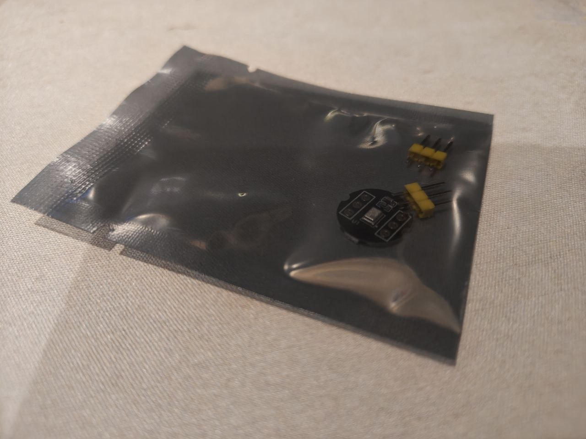
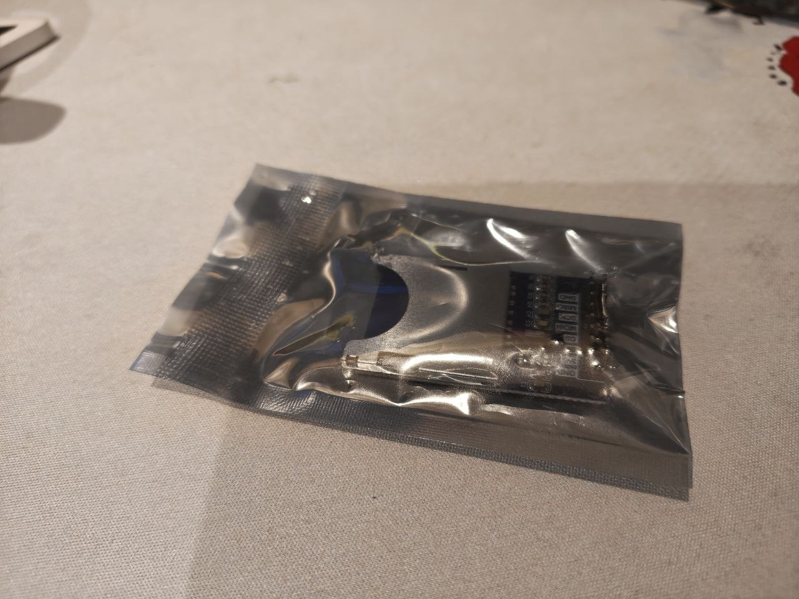

# Acoustic UAV Detector

Пасивний акустичний детектор дронів. Три цифрові MEMS-мікрофони, розставлені
рівностороннім трикутником, слухають шум пропелерів; мікроконтролер порівнює,
на скільки раніше звук дійшов до кожного мікрофона (TDOA, метод GCC-PHAT), і з
цих різниць обчислює азимут — напрямок на джерело в межах повних 360°.

Пристрій нічого не випромінює: він тільки слухає. Тому працює без GNSS і без
радіозв'язку — там, де радіочастотний спектр заглушений, — і не потребує
дозволу на передачу.

Це навчальний прототип. Спершу бредборд і запис 3-канального звуку на microSD
для офлайн-аналізу, далі — обчислення азимута в реальному часі, і вже потім
герметичний корпус для роботи на вулиці від акумулятора.

Чого пристрій не вміє: дальність скромна (сотні метрів, залежить від фонового
шуму й типу дрона), вітер і міський шум псують точність, а плоский масив із
трьох мікрофонів дає лише азимут — без кута підвищення.

Технічні деталі (розпіновка, геометрія масиву, конвеєр обробки сигналу) — у
[CLAUDE.md](CLAUDE.md).

## Компоненти

### Мікроконтролер

Devkit-плата на модулі ESP-WROOM-32: 30 пінів, USB-C для живлення та
прошивки. Мозок пристрою — читає мікрофони, робить кореляційні обчислення,
пише результат на карту.

Критично важливо, що чип має **два** незалежні I2S-контролери. Один
контролер обслуговує лише два мікрофони (лівий і правий канали одного
стерео-потоку), тож третій мікрофон іде на другий контролер. Обидва мають
працювати від синхронізованого тактування, інакше потоки «поїдуть» один
відносно одного і вся математика напрямку стане недійсною.

Кількість: 1.

### Мікрофони

INMP441 — цифровий MEMS-мікрофон з I2S-виходом, на круглій платі-брейкауті
(гребінки в комплекті, ще не припаяні). Цифровий вихід означає, що на
з'єднанні від мікрофона до плати немає аналогового сигналу, який можна
зіпсувати наводками, — це головна причина обрати саме такий мікрофон, а не
аналоговий капсуль із підсилювачем.

Живлення строго 3.3 В — 5 В спалить модуль. Пін L/R задає, у якому слоті
стерео-потоку мікрофон віддає дані: на GND — лівий канал, на 3V3 — правий.
Саме так два мікрофони працюють на одній шині I2S.

Кількість: 3 (по одному на вершину трикутника, база близько 15 см).

### Модуль microSD

Тримач картки microSD з інтерфейсом SPI (виводи GND, MISO, SCK, MOSI, CS,
живлення). Пише сирі 3-канальні записи (WAV) і лог детекцій та азимутів.
Записи потрібні насамперед для офлайн-налагодження алгоритму на комп'ютері:
значно легше крутити параметри фільтра й кореляції на Python над готовим
файлом, ніж перепрошивати плату на кожну ітерацію.

Перед підключенням варто перевірити, на яку напругу розрахований саме цей
модуль: компактні платки зазвичай живляться напряму від 3.3 В без власного
стабілізатора, тоді як більші мають LDO і чекають 5 В.

Кількість: 1 (плюс сама картка).

### Решта збірки

- Пласка жорстка основа для масиву (фанера, FR4 або друкована рамка) — вершини
  трикутника мають бути зафіксовані з точністю до кількох міліметрів, бо
  похибка геометрії напряму перетворюється на похибку азимута.
- Поролонові ветрозахисні насадки на кожен мікрофон: вітер — головний
  руйнівник TDOA на вулиці.
- Протоборд, дроти, пасивні компоненти. Лінії I2S тримати короткими
  (10–15 см), для рознесених мікрофонів — кручена пара або екранований кабель.
- Живлення: USB-C 5 В на столі; для поля — 18650 з платою захисту і
  стабілізацією на 3.3 В / 5 В.
- Пізніше: герметичний корпус (IP) і кріплення для підняття масиву над землею.

## Стан проєкту

Компоненти закуплені, збірка ще не починалася. Наступний крок — підняти
захват із двох I2S-контролерів і **довести** вирівнювання трьох потоків по
семплах. Це блокує все інше: без підтвердженої синхронізації обчислення
напрямку не має сенсу.
