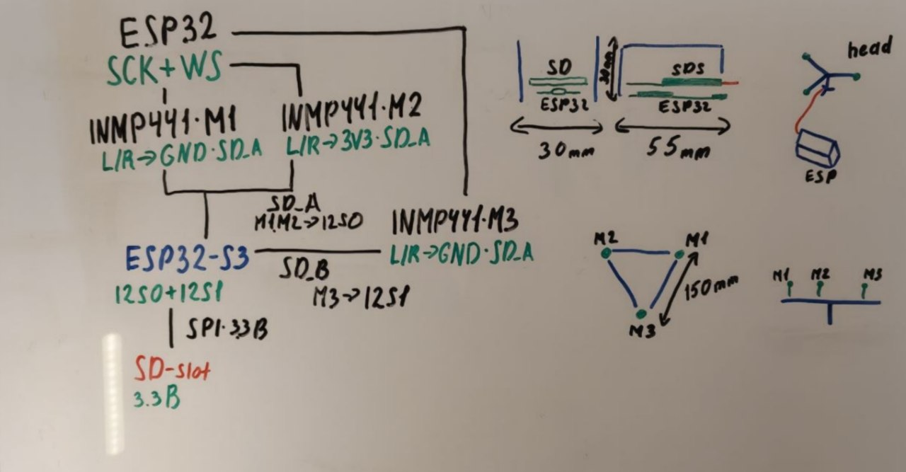
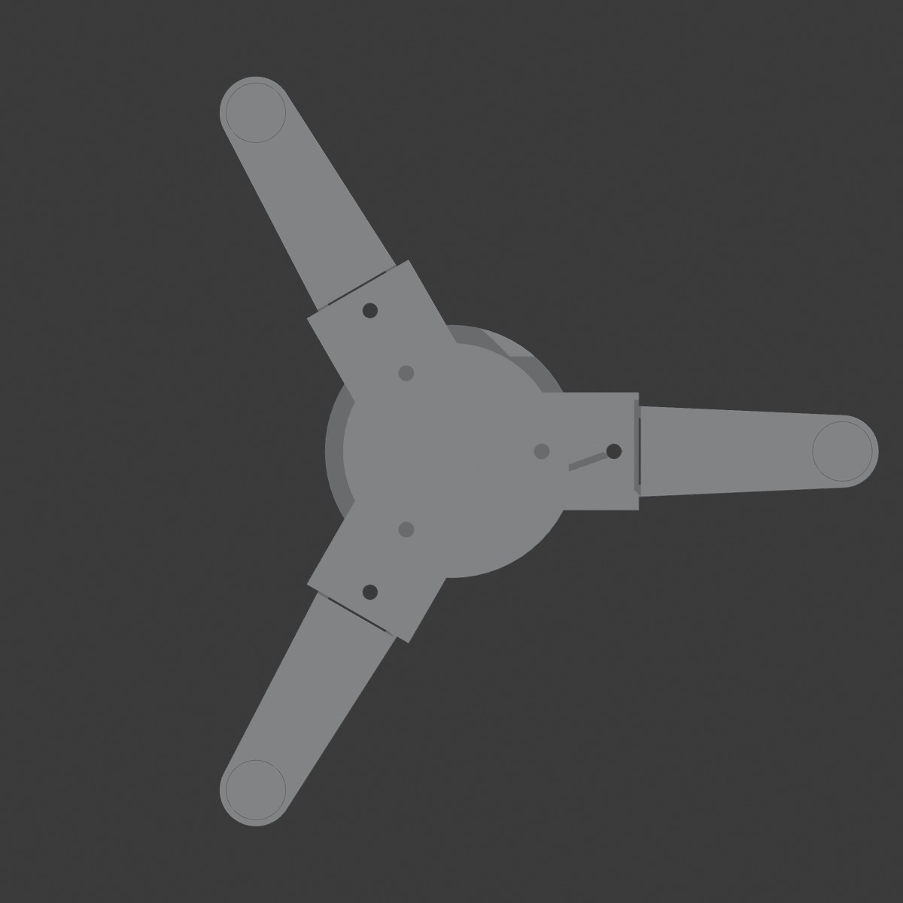
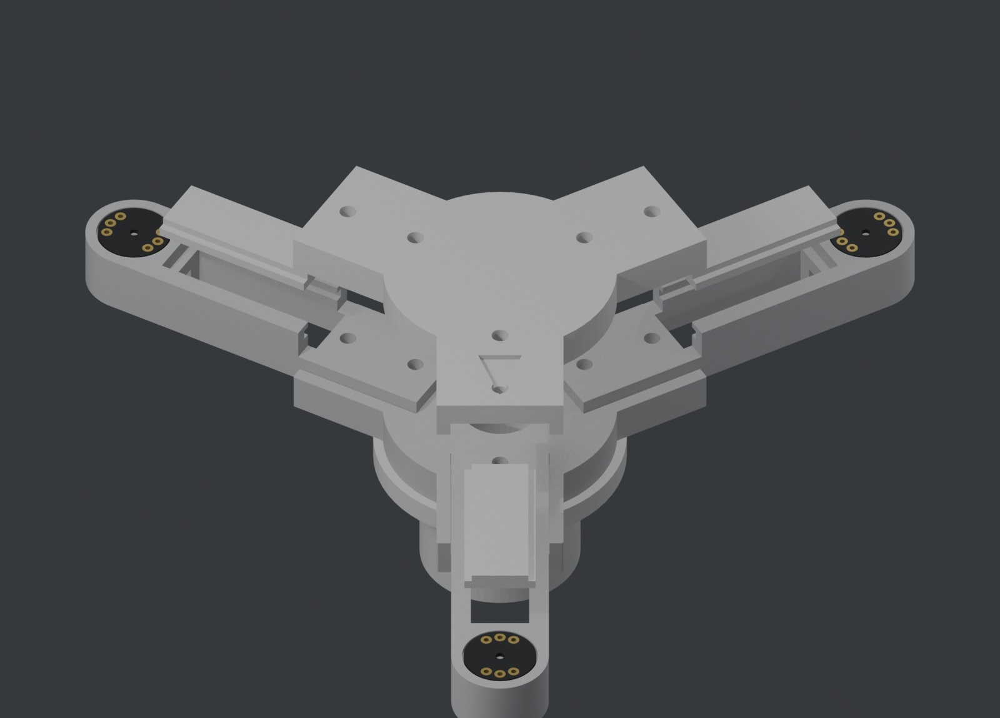
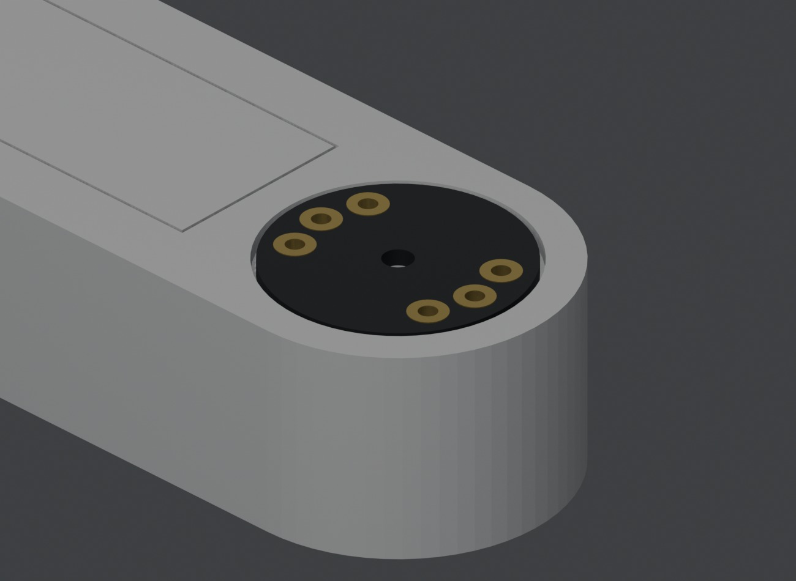
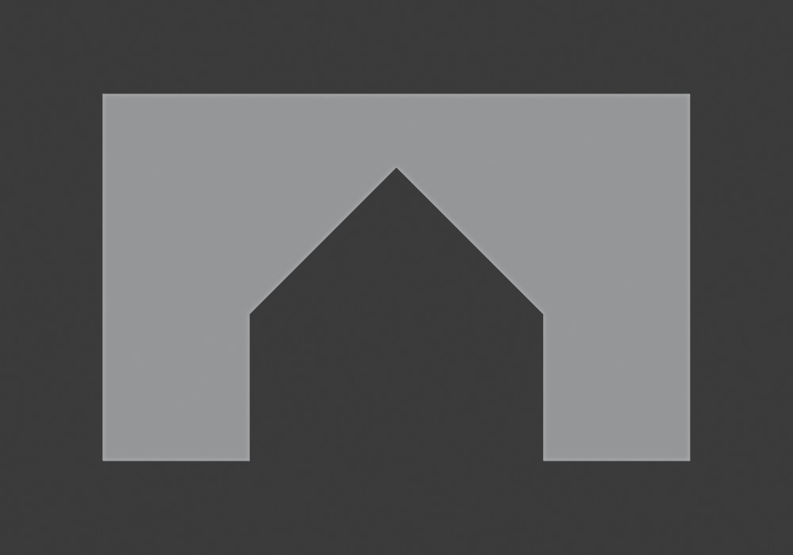
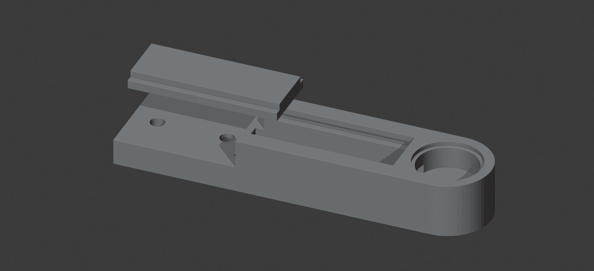
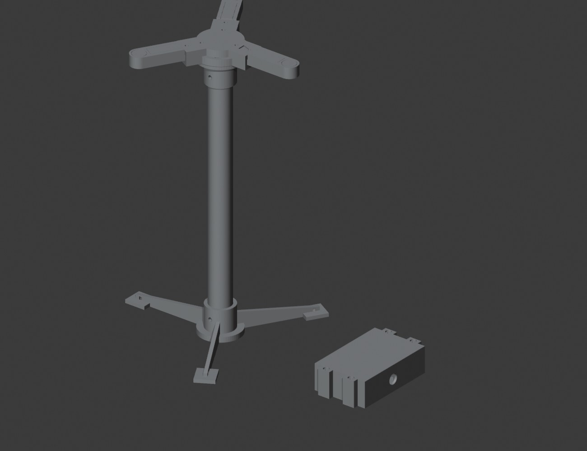
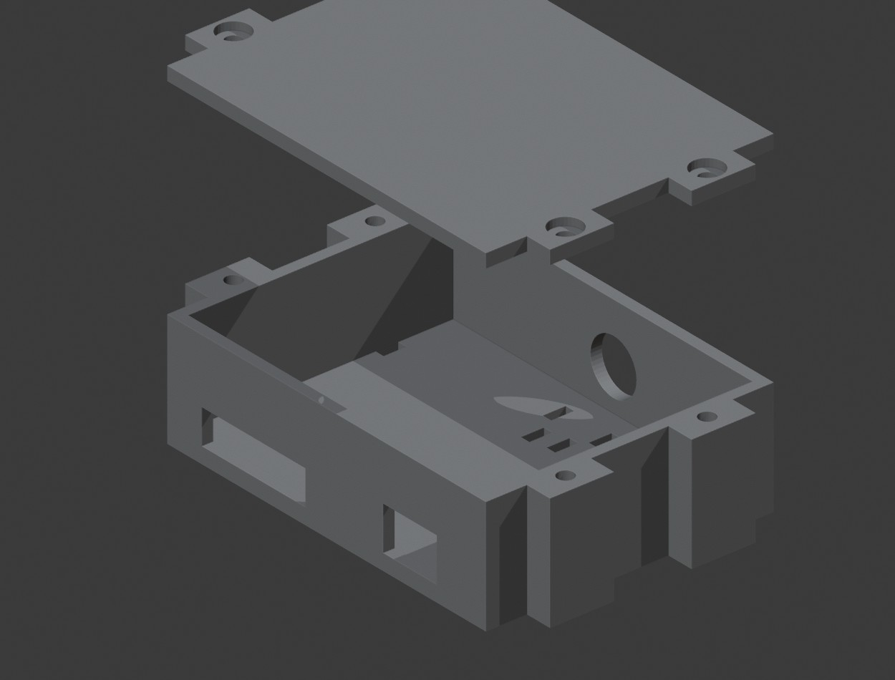
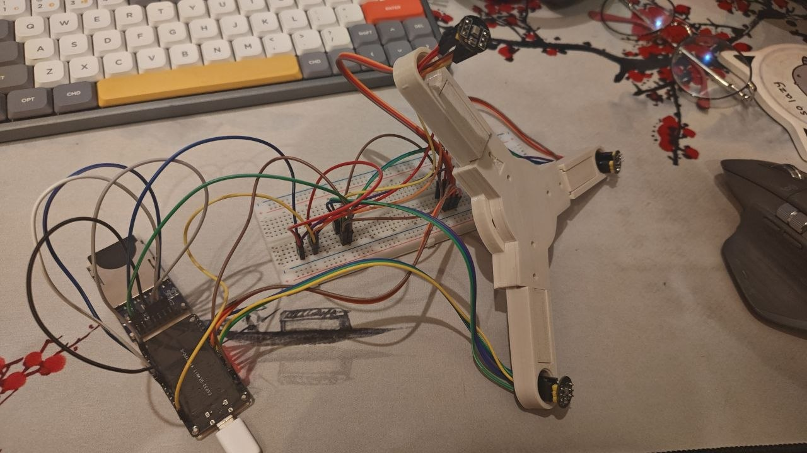

# Acoustic UAV Detector

A passive acoustic drone detector. Three digital MEMS microphones, placed at the
vertices of an equilateral triangle, listen for propeller noise; the
microcontroller measures how much earlier the sound reached each microphone
(TDOA, via GCC-PHAT) and turns those differences into an azimuth — the bearing
to the source over a full 360°.

The device emits nothing: it only listens. That means it works without GNSS and
without radio — including where the RF spectrum is jammed — and needs no
transmit permit.

This is a learning prototype. First a breadboard build that records 3-channel
audio to microSD for offline analysis, then real-time azimuth estimation on the
device, and only after that a weatherized enclosure for outdoor battery
operation.

What it cannot do: range is modest (hundreds of meters, depending on background
noise and drone type), wind and urban noise degrade accuracy, and a flat
three-microphone array yields azimuth only — no elevation.

## The whole thing on one page

Everything the build needs is on this one sheet: the signal chain down the left,
the board footprints and the head assembly across the top right, and the array
geometry — triangle and edge-on view — along the bottom right. The sections below
just read it out in words.

## How it is wired

An I2S bus carries two channels, so three microphones need both of the chip's I2S
controllers. The important part of the design is that only **one** of them
generates the clock. The clock pair — SCK (bit clock) and WS (which channel is on
the wire) — leaves the first controller, runs as a shared bus to all three
microphones, and also feeds back into the second controller, which is configured
as a slave and generates nothing.

Only the data lines are separate: `SD_A` brings back microphones M1 and M2 as one
stereo stream, `SD_B` brings back M3 on its own. The card sits on SPI at 3.3 V.

On the DevKit V1 the pins are assigned like this — this is the map the bench
build is actually wired to:

| Signal | GPIO | Notes |
|---|---|---|
| SCK — shared bit clock | 26 | driven by I2S0, runs to all three microphones |
| WS — shared word select | 25 | driven by I2S0, runs to all three microphones |
| `SD_A` — M1 + M2 data | 33 | I2S0 data in |
| `SD_B` — M3 data | 32 | I2S1 data in |
| SCK return | 14 | I2S1 bit-clock input (slave), jumpered from the SCK bus |
| WS return | 27 | I2S1 word-select input (slave), jumpered from the WS bus |
| SD card — SCK / MISO / MOSI / CS | 18 / 19 / 23 / 5 | VSPI, module powered from 3.3 V |

The L/R select pin is the only wire that differs between microphones:
**M1 → GND** (left slot), **M2 → 3V3** (right slot), **M3 → GND** (left again —
it is alone on its data line, so there is nothing to collide with). Every VDD
goes to 3.3 V, no exceptions; a microphone left unpowered does not just stay
silent, its protection diodes clamp the shared data line to ground and the
whole line reads as zeros.

The point of the single clock is that every microphone samples on the same clock
edge, so the three streams cannot drift apart — which is exactly what would
happen with two independent clocks. What can still differ is the instant each
receive buffer starts filling, and that appears as a fixed offset of a whole
number of samples between the two data lines. A fixed offset is harmless: measure
it once, subtract it forever. Proving that it really is fixed — the same after
every reboot, stable over a long recording — is the first milestone of the build.

## The array

Three microphones on an equilateral triangle with 150 mm sides: M1 at the apex,
M2 and M3 at the base, and the centroid marked in the middle. Each microphone is
86.6 mm from the centre. Bearings are reported relative to M1, so whichever frame
is built, the M1 corner has to be marked physically and its real-world heading
noted when the array is set up — otherwise an azimuth means nothing.

There are two ways to hold the microphones in that shape. One is a solid flat
plate with the microphones at its corners: simple and rigid, but the plate is a
reflecting surface directly under the capsules and it catches wind. The other is
a three-armed frame. Both put the microphones in identical positions, so this is
a construction choice, not a change to the algorithm.

The three-armed frame won, and it is now designed and modelled — see
[The printed frame](#the-printed-frame) below. All three capsules sit on one
horizontal plane and everything solid hangs below them, out of the acoustic
path; the frame also offers the wind far less to push against.

The electronics live in a separate box that stands next to the array rather than
hanging under the hub, so the frame carries nothing but itself.

## The printed frame

Three identical arms bolt into a two-plate hub; the hub bolts to a socket on a
bought tube. Everything is PETG, printed without supports. STL files are in
[`hardware/`](hardware/).

The exploded view above shows the whole stack: the hub's top plate lifted off, the
three slide-in arm lids drawn back, and under each of them the cable channel that
runs out to the microphone. The three boards sit flush in their seats at the tips,
acoustic ports facing the sky.

### What accuracy is actually needed

This is the number that drove every decision. For a baseline `b`, an error `δ` in
a microphone's position produces a bearing error of roughly `δ / b`. With
`b = 150 mm`, **1 mm of geometric error costs 0.38° of azimuth.**

That is worth comparing against what the timing side can resolve. One sample at
48 kHz is 20.8 µs, which is 7.1 mm of sound travel; GCC-PHAT with sub-sample
interpolation reaches roughly a tenth of that, so about 0.7 mm equivalent. So the
target for the frame is **~1 mm** — tighter is wasted effort because it drowns in
correlation noise, looser becomes the dominant error term.

A second, easier rule falls out of the same maths: errors that are *identical on
all three channels* do not turn into bearing error at all. Thermal expansion of
the arms (0.18 mm over 86.6 mm for a 30 °C swing) is common to all three and
cancels. This is why the three arms are printed from one file, in one batch, and
why the cable should be routed the same way on each arm even though M3 needs a
different bundle.

### Arms do not flex — joints slip

The obvious worry with a three-armed frame is that thin arms bend, and bending is
geometric error. Run the numbers for the leanest section the arm has ever had — a
PETG channel 20 × 12.5 mm on 2.5 mm walls, cantilevered 86.6 mm — read the table
as an upper bound:

| Load | Tip deflection |
|---|---|
| Microphone + windscreen (5 g) | 0.001 mm |
| The arm's own weight (12 g) | 0.001 mm |
| 20 m/s wind on a Ø40 mm windscreen (0.15 N) | 0.005 mm |

Two to three orders of magnitude below the 1 mm that matters. Beam stiffness is
a non-issue at this scale; the whole error budget lives in the **joints** and in
**how the microphone board is seated**. So the arms are kept light and the joints
are over-built, not the other way round.

### The joint

Each arm ends in a flat tab, 20 × 6 × 28 mm, clamped between two hub plates. The
tab drops into a 3 mm pocket milled into each plate (0.15 mm clearance per side);
the inner end of the pocket is a hard face that the tab butts against, and *that*
is what sets the 86.6 mm radius — not the bolt holes, which have clearance and
would let the arm creep. Two M3 bolts per arm clamp through into hex nut pockets.

A socket-and-tongue hub was tried first and dropped. Three sockets radiating at
120° cannot all be vertical in any print orientation, so each would need a 16 mm
bridged ceiling — and that rough bridged surface would have become the datum
setting capsule coplanarity. Two flat plates print with no overhangs at all.

The M1 heading is engraved into the top plate. Without a physical mark an azimuth
means nothing.

### The microphone seat

The INMP441 breakout is a **15 mm** round board, 1 mm thick. (The first printed
iteration was built for 13 mm and the board would not go in — measure yours before
printing three of them.) Two properties of it shape the tip:

- The acoustic port is **central**. The MEMS die is bottom-ported and the PCB is
  drilled through beneath it, so the hole sits on the board's axis. Board rotation
  therefore does not move the acoustic point — one less thing to control.
- Sound enters from the **bare face**, opposite the chip. The board must be
  mounted chip-down, bare face to the sky, or the port is sealed. Do not fit the
  supplied headers; solder wires directly to the pads from the chip side.

The tip has a Ø15.6 × 1.0 mm recess so the board sits flush with the arm's top
face — flush, not sunk, because a cavity above the port is a Helmholtz resonator
and a resonator is a phase shift, which reads as a fake delay. The recess wall
centres the board mechanically, which is where the 1 mm budget is actually spent.
Clearance is a generous 0.3 mm per side; the resulting 0.3 mm of possible
off-centre costs 0.06° of azimuth, so there is nothing to gain by making it tight.

Below it is a Ø14 × 8.5 mm clearance cavity, leaving a 0.8 mm ledge at R7.0–7.8.
The six pads run close to the board's rim, so solder joints may still touch that
ledge and hold one edge of the board a few tenths high. That is deliberate and
harmless: in-plane position — the part that matters — is set by the recess wall,
not by the ledge, and a 0.3 mm out-of-plane tilt costs about 0.05° for a source
at 30° elevation. Trim the solder flush if you like; it changes almost nothing.

Recess plus cavity make the pocket **9.5 mm deep** — it was 6.0 mm until the board
was fitted with pins, which take the board-plus-legs stack to about 9 mm. The half
millimetre left over is not slack, it is the whole point: if the pocket were
exactly 9 mm, whether the board landed on the ledge or on its own pin tips would be
a coin toss, and landing on the pins would lift it off the seat and throw away the
centring the recess exists to provide. The seat has to be the only thing the board
touches.

Fitting the Ø15.6 recess is what drove the tip to Ø20 and, with it, the arm to a
constant 20 mm width. At the old Ø16 tip there would have been 0.2 mm of wall left
around the board.

A side tunnel carries the wires into the arm's channel and vents the cavity so it
is not a sealed pressure chamber.

Straight down through the cavity floor runs a **Ø10 hole to the underside of the
arm**. Its job is to get a board back out: seated in a 0.3 mm recess and held by
tape, a 15 mm disc is otherwise very hard to lift without levering against the
0.8 mm ledge and breaking it. Push a rod up the hole instead and the board lifts
straight out. It costs nothing structurally — 3 mm of solid tip still sits below
the cavity, and the hole is R5 while the seat ledge is at R7.0–7.8, so they never
meet — and it doubles as a drain for anything that finds its way into the cavity.

Rain is unresolved. The port faces up, which is right for a source overhead and
wrong for weather. A hydrophobic PTFE membrane under the board is the standard
answer — it adds a phase shift, but an identical one on all three channels, so it
is common-mode and harmless.

### The cable route

The cable never leaves the structure. From the pin tips under the board it drops to
the floor of the Ø14 cavity, crosses a 5 × 2.75 mm tunnel that sits on that floor,
runs the length of the arm inside the channel, passes under the tab through a
groove that the hub pocket floor closes into a tunnel, follows a groove in the
lower plate to the centre, and drops through the Ø16 hole into the tube. It exits
under the foot.

Five conductors per microphone (VDD, GND, SD, SCK, WS) fit the 13.75 mm² tunnel
with room to spare. The tunnel also vents the microphone cavity, so it is not a
sealed volume that pumps with temperature. It sits on the cavity floor rather than
part-way up the wall because that is where the pin tips end — anywhere higher and
the wires would have to be led back up before they could leave.

The groove under the tab is 6 mm wide and centred, which puts the two M3 bolts
straight through the middle of it. That leaves 1.3 mm of clear width either side of
each bolt shank — enough for thin wire split two and three, but it makes assembly
order matter: **push the wires aside before tightening**, or the bolt will nip the
insulation and you will not see it happen. Moving the bolts off the centreline
would clear the path completely, at the cost of relocating the holes and nut
pockets in both hub plates.

The lower hub plate carries the cable the rest of the way. Where the tab ends, a
tunnel runs on under the parting face from the tab pocket to the Ø16 bore in the
centre — 6 mm wide, 2 mm tall, roofed over for its whole 6 mm length. It is the
one closed passage in the hub, and it has to be the same width as the groove that
feeds it: it was 12 mm to match the old groove, and halving one without the other
would just have moved the bridge rather than shrunk it.

The 5 mm of solid material between the channel and the cavity is deliberate — it
is what carries the seat ledge. Running the channel all the way out to the cavity
would leave the ledge, and therefore the microphone, cantilevered over a void.

### The mast

The mast is a **bought Ø25 mm tube**, held at each end by a printed socket. It is
not printed, for two reasons. An aluminium tube of Ø25 × 1.5 mm has
`EI ≈ 5.4·10⁸ N·mm²` against `3.5·10⁷` for a printed PETG mast of the same
diameter — roughly **15× stiffer**. And a 200 mm printed tower is a four-hour
single-column print that can fail at any point in it, whereas the two fittings are
32 mm tall.

Each fitting is a plain flanged socket: Ø25.4 bore, 26 mm deep, with a shoulder
that stops the tube square, and one M4 bolt straight through both walls and the
tube. Drill the tube using the printed part as the jig — slide it in, run a
Ø4.5 mm bit through the moulded holes, bolt it up.

Earlier versions used a pinch clamp so the tube would not have to be drilled.
That design is kept as `*_v1_*` but should not be printed: its clamp ears hang
7 mm above the flange with nothing under them, and the obvious fix defeats itself.
Buttress an ear down to the flange and the clamp is welded shut — a pinch works
only because its halves are free to move. Running the slot through the flange too
would make the whole part a C, but then the three M4 bolts holding that flange to
the hub would prise the clamp back open. A through-bolt removes the ears, the
slot and the nut pockets in one move, and is stronger and more positive than the
clamp ever was. It costs one drilled hole per joint, in a tube you are cutting to
length anyway.

Aluminium is the best choice, PVC conduit the cheapest, acrylic acceptable but
brittle. Inner diameter must be at least 18 mm; the cable runs down inside the
tube and exits under the foot.

Tube length is free. With 300 mm, the acoustic plane sits 328 mm above ground.

The tripod is deliberately light, and that has a cost worth knowing. The
overturning lever arm of a tripod is not the foot radius but half of it, because
it tips over the line joining two feet — about 53 mm here. Against a total mass
near 260 g, wind starts to overturn the stand at roughly **10 m/s**. The three
feet have Ø5 mm holes for ground pegs; outdoors, use them.

### Parts and hardware

`hardware/` holds only what you would print today. Everything that has been
replaced lives in `hardware/superseded/`, so you cannot pick the wrong file by
accident but nothing is lost either — a printed part is evidence, and you want to
be able to go back to the file it came from.

File names carry an iteration number and the dimension that defines it, so a part
that was never revised keeps its `_v1` and that is not a mistake.

**Build this:**

| STL | Qty | Mass | Size (mm) |
|---|---|---|---|
| `arm_body_v4_mic15.stl` | 3 | 11.2 g | 82.6 × 20 × 12.5 |
| `arm_lid_v2_mic15_slide.stl` | 3 | 2.0 g | 34.2 × 14.6 × 3.5 |
| `hub_top_v1.stl` | 1 | 26.4 g | 73.5 × 84.9 × 8 |
| `hub_bottom_v3.stl` | 1 | 23.7 g | 73.4 × 84.6 × 8 |
| `tube_collar_top_v3.stl` | 1 | 19.2 g | 45.9 × 53 × 31 |
| `tube_foot_v2_tube25.stl` | 1 | 47.4 g | 176 × 203 × 32 |

156 g of PETG in total, plus the tube.

The two-part arm is the one to build. `arm_v4_mic15.stl` (11.5 g, same envelope)
is the same arm in one piece, for anyone who would rather not have a sliding lid;
it prints with one more bridge and cannot be re-opened to change a wire. Take one
or the other, never both.

The lid has not changed since v2, so it keeps its v2 name — the version number
tracks the part, not the build.

**In `hardware/superseded/` — kept for reference, do not print:**

| STL | Why it was replaced |
|---|---|
| `arm_v1_mic13.stl` | seat built for a Ø13 board; the real board is Ø15 |
| `arm_body_v1_mic13.stl` | same, and its lid needed glue |
| `arm_lid_v1_mic13_glued.stl` | superseded by the slide-in lid |
| `arm_v2_mic15.stl` | 6 mm microphone pocket — too shallow once the board had pins |
| `arm_body_v2_mic15.stl` | same |
| `arm_v3_mic15.stl` | gabled the cable channel, which never needed it — see below |
| `arm_body_v3_mic15.stl` | same |
| `hub_bottom_v1.stl` | 12 mm cable tunnels, widened to match the arm groove that has since halved |
| `hub_bottom_v2.stl` | carried its own M4 holes for the collar, which the arm bolts now do |
| `tube_collar_top_v2_tube25.stl` | round Ø52 flange on 3 × M4 of its own; v3 shares the arm bolts |
| `tube_collar_top_v1_tube25.stl` | pinch-clamp ears hang unsupported over the flange |
| `tube_foot_v1_tube25.stl` | same |

- 6 × M3×16 + 6 nuts — arms to hub, nuts captive in the lower plate
- 3 × M3×7 — the top fitting, screwed **into the same three inner nuts** from below
- 1 × M4×40 + nyloc nut + 2 washers — through the fitting and the tube

The fitting has no fasteners of its own. Its three petals land on the arms' inner
bolt circle at r 20, so the nuts that hold the arms hold the mast as well — the
alternative was a second set of holes through the one plate the cable has to cross.
Give those three inner nuts to the fitting and clamp each arm on its outer bolt
only; the tab is 20.3 mm wide in a pocket that already stops it rotating, so the
second bolt was never what held it straight.

No heat-set inserts anywhere: every bolt lands in a hex nut pocket, which is
both cheaper and stronger in PETG than an insert.

### Printing

PETG, chosen over PLA for outdoor service — PLA softens near 60 °C, which a dark
part in the sun will reach, and its creep under sustained load is exactly the
slow geometric drift this instrument cannot tolerate.

0.2 mm layers, 4 perimeters, 30 % gyroid infill. Every STL is saved in its print
orientation — drop it on the bed as-is, and **no part needs support material.**

The arm is the one that has to be printed the right way up, tab down. Inverted it
looks tempting, because the microphone seat would then face the bed and come out
flatter — but the root tab ends up floating 6.5 mm above the bed over a 28 × 20 mm
area, and that is a support block you then have to dig out of PETG. Printed the
right way up, the tab and the side walls sit flat on the bed.

The two-part arm has exactly two internal ceilings, and both are genuine bridges —
the extruder pulls the filament between two walls, nothing is deposited underneath,
and neither surface is one anybody sees or measures:

| Ceiling | Span | Area | Where |
|---|---|---|---|
| Tab cable groove | 6 mm | 138 mm² | under the root tab |
| Cable tunnel | 5 mm | 26 mm² | between cavity and channel |
| Lid undercut | 1.5 mm | 104 mm² | the ledge the lid flange slides under |

The cable channel itself is not on that list: with the lid off it has no ceiling at
all, and the lid closes it after printing. The one-piece arm adds a third bridge,
the channel ceiling, 15 mm wide and 32.6 mm long.

The tab groove was 12 mm and is now 6, which halves that bridge. It could not
simply be narrowed and left where it was — see [the cable route](#the-cable-route)
for the bolts that run through it.

PETG bridges all of these fine with the part cooling fan on; use a brim anyway.

Every printed part has been swept for downward-facing surfaces in the orientation
its STL is saved in. Nothing else in the build bridges more than 6 mm:

| Part | Widest ceiling | What it is |
|---|---|---|
| `hub_top_v1` | **8.9 mm** | the engraved M1 arrow |
| `hub_bottom_v3` | 6.0 mm | the cable tunnels |
| `tube_collar_top_v3`, `tube_foot_v2` | under 1 mm | crowns of the horizontal bolt holes |
| `case_base_v2`, `case_lid_v2` | 3.1 mm | board shelves and openings |
| `arm_lid_v2`, `case_clamp_v2` | none | print with no overhang at all |

The M1 arrow is the widest span left in the build, and it is the one that matters
least: it is 1.2 mm deep, it faces the bed, and the surface it produces is the
inside of a decorative groove. Cutting the arrow as an outline instead of a solid
triangle would take it to about 1.5 mm if that ever became worth doing.

The horizontal bolt holes in the tube fittings are a different animal — a hole
drilled sideways always overhangs at its crown, whatever you do. They come out
slightly oval; ream them if the M4 is tight.

There was briefly a v3 that replaced the channel ceiling with a 45° gable so it
would not bridge at all. It worked, but it solved a problem the two-part arm does
not have — the lid already removes that ceiling — and it cost 2.6 g an arm to do
it. Kept in the superseded list as a record, not as an option.

`arm_body_v4_mic15.stl` + `arm_lid_v2_mic15_slide.stl` go together with **no glue
and no fasteners** — the lid is a T-bar that slides into a matching T-slot in the
body, from the root end, until it stops against the tip block.

| | |
|---|---|
| Lid flange | 14.6 mm wide × 1.95 mm |
| Lid rib | 11.6 mm wide × 1.55 mm, flush with the top face |
| Retaining lip | 1.4 mm thick, projecting 1.5 mm |
| Support shelf | 1.5 mm wide |
| Clearance | 0.20 mm per side, 0.15 mm vertical |
| Travel | 34.6 mm |

The lip started at 0.8 mm — four layers — which is plenty for the load (the lid
weighs 2 g) but thin enough to snap off while threading the lid in. The lid pocket
was deepened from 2.5 to 3.5 mm to buy the thickness back; the cable channel loses
1 mm of height and is still 12 × 9 mm.

Print the lid **flange down**. The rib is the narrower of the two, so it sits on
the wider flange and the part has no overhang at all.

The flange rests on shelves inside the slot and the lips above it stop it lifting
out, so it is captive in every direction but one. That last one is closed on
assembly: the hub's top plate overlaps the lid's end face, so once the arm is
bolted down the lid cannot come back out.

This is why the split had to move. A lid that slides in sideways cannot contain
the Ø20 tip — it would not fit through its own slot — so the tip, with the
microphone seat, now belongs to the body. That turns out better anyway: with no
lid over it, the body's cable channel has **no ceiling to bridge at all**, and the
lid becomes a 1.5 g strip that prints in minutes.

It also means the wiring is reworkable. Slide the lid out, change a wire, slide it
back — no glue to cut.

Print all three arms together, from the same file and spool, so their errors stay
common-mode.

### Still open

Windscreens are not designed in yet. The tip is a Ø16 rounded boss, so a foam
ball with a matching bore pushes straight on; a retaining feature can be added
once the actual foam is in hand.

## The electronics box

A separate box that stands on the ground next to the tripod, holding the ESP32 and
the SD module. It carries no part of the array, so nothing in it affects geometry
or accuracy — which is exactly why it is separate.

### Why it does not fit the boards tightly

Neither board has a dimension you can trust. The ESP32 DevKit V1 is
[documented at 51.8 × 28.2 mm](https://mischianti.org/doit-esp32-dev-kit-v1-high-resolution-pinout-and-specs/)
and measures 50 × 28 with calipers — a difference explained by whether the USB
shell is included. The SD module is worse: the
[shop lists 50 × 33 mm](https://arduino.ua/prod589-modyl-sd-card-dlya-arduino-spi),
calipers say 46 × 29, and other sellers quote 41 × 24, 42 × 24 and 53 × 38 for
boards under the same name. There is no datasheet. A 4 mm discrepancy on both
sides is not rounding — it is a different board revision.

So the mounting is adjustable rather than fitted. The bays are sized for the
largest plausible board — 53 × 29.5 mm for the ESP32 and 52 × 35 mm for the SD
module — and each board is held the same way at any size between 46 × 29 and
50 × 33. Boards can be moved, swapped, or replaced with something else entirely
without reprinting the box.

### How the boards are held

Two constraints shape this, and both come from the ESP32.

Its pin headers are soldered on the underside, and the tails stand about 3 mm
proud. **The board cannot rest on the floor.** And the pin rows run along both
long edges, so **it cannot be supported at its edges either** — anything under the
edge fouls the pins.

What is left is the middle. Each board sits on **four Ø9 pads, 4 mm tall**, well
inboard of the pin rows, putting the PCB underside at 9 mm and its top face at
10.6 mm. The pin tails hang free with 1 mm to spare above the floor.

Retention is then purely from above, on the board's edges:

| | |
|---|---|
| Outer edge | fixed lip moulded into the wall, reaching 2.5 mm over the board |
| Inner edge | `case_clamp_v2.stl` on a T-slot, one M3 |
| Clamp travel | 12 mm — covers every quoted board width |
| Board thickness assumed | 1.6 mm |

Slide the board under the fixed lip, push the clamp against the free edge,
tighten. The clamp carries a 3.4 mm key rib that rides inside the slot, so one
screw is enough — it cannot rotate. Its nut lives in a channel milled into the
underside of the floor and slides in from the outside edge, which is why the floor
is 5 mm rather than 3.

Cable-tie slots are still in the floor beside each bay, for tying down wiring
looms or anything the clamps do not suit.

### Openings

| Feature | Size | Where |
|---|---|---|
| USB-C window | 14 × 10 mm | short wall, on the ESP32 bay |
| SD card window | 27 × 10 mm | short wall, on the SD bay |
| Cable entry | Ø12 mm | opposite wall, between the bays |

The windows are deliberately much bigger than the connectors, because the boards'
positions are set by where you tie them down, not by the box. Both straddle the board's top face at
10.6 mm and leave 9 mm of solid wall above, so the wall is not cut into pillars. Two cable-tie slots beside the cable entry take the strain off
the joints inside.

The seven conductors from the array (VDD, GND, SCK, WS and three SD lines) come in
through the Ø12 entry. Nothing is weatherproof yet — that belongs with the IP
enclosure, and these windows will need covers.

### Parts

| STL | Qty | Mass | Size (mm) |
|---|---|---|---|
| `case_base_v2_63x108.stl` | 1 | 70.7 g | 63 × 108 × 27 |
| `case_lid_v2_63x108.stl` | 1 | 25.3 g | 63 × 108 × 5 |
| `case_clamp_v2.stl` | 2 | 2.5 g | 25 × 12 × 10 |

101 g of PETG. Hardware:

- 4 × M3×30 + 4 nuts — lid to base. The nuts drop into 3.2 mm hex pockets in the
  underside of the bosses, so a 2.4 mm M3 nut ends up flush and the box still
  stands flat. Screw heads countersink into the lid.
- 2 × M3×16 + 2 nuts — the board clamps, nuts captive in the floor's T-channels.

Everything prints without support. The base goes floor-down, open side up; its
only overhangs are the two window ceilings, bridging 14 and 27 mm. The lid prints
**top face down**, so its locating lip points up and the visible face is the one
that came off the plate. The clamp prints **lip down** — the section only narrows
going up, so there is no overhang at all.

`case_base_v1_63x95.stl` and `case_lid_v1_63x95.stl` are superseded: they had no
board mounting, and their floor was too thin to hold a captive nut.

## Components

### Microcontroller

A devkit board built around the ESP-WROOM-32 module: 30 pins, USB-C for power
and flashing. The brain of the device — it reads the microphones, runs the
correlation math, and writes results to the card.

The critical property is that the chip has **two** independent I2S controllers,
which is what makes three microphones possible at all — see the wiring section
above for how they share a clock.

Quantity: 1.

### Microphones

INMP441 — a digital MEMS microphone with an I2S output, on a round breakout
board (headers soldered on for the breadboard stage; the arm's microphone
pocket was deepened to 9.5 mm precisely so the board still seats with the pins
on). A digital output means there is no
analog signal on the run from microphone to board that stray pickup could
corrupt — that is the main reason to choose this part over an analog capsule
plus preamp.

Supply is strictly 3.3 V; 5 V will destroy the module. The L/R pin selects which
slot of the stereo stream the microphone drives its data into: tied to GND it is
the left channel, tied to 3V3 the right. That is exactly how two microphones
share one I2S bus.

Quantity: 3 (one per triangle vertex, baseline about 15 cm).

### microSD module

A microSD card holder with an SPI interface (GND, MISO, SCK, MOSI, CS, power).
It stores raw 3-channel recordings (WAV) plus a log of detections and azimuths.
The recordings matter mostly for debugging the algorithm offline on a computer:
tuning filter and correlation parameters in Python against a saved file is far
easier than reflashing the board on every iteration.

This is the compact variant, with neither an onboard regulator nor a level
shifter, so it runs directly on 3.3 V — the same rail as the microphones. (The
larger modules, the ones carrying an LDO, are what expect 5 V; this is not one of
those.)

Quantity: 1 (plus the card itself).

### Rest of the build

- A rigid frame for the array — designed and modelled, see
  [The printed frame](#the-printed-frame). Vertices are held to about 1 mm,
  because geometric error maps directly onto azimuth error.
- A Ø25 mm tube for the mast (aluminium, PVC or acrylic), cut to the height you
  want, plus three ground pegs.
- Foam windscreens for every microphone: wind is the main TDOA killer outdoors.
- Protoboard, wire, passives. Keep I2S runs short (10–15 cm); for spatially
  separated microphones use twisted pairs or shielded cable.
- Power: USB-C 5 V on the bench; for the field, an 18650 with a protection board
  and 3.3 V / 5 V regulation.
- Later: a weatherized (IP-rated) enclosure, and rain protection for the
  upward-facing microphone ports.

## Project status

The frame is printed and assembled, and the whole signal chain has had first
light on the bench: all three microphones and the SD card, alive at the same
time on one ESP32.

Bench bring-up (September 2026), done with throwaway MicroPython smoke tests
over the pin map above:

- **M1 + M2** verified as one stereo stream on `SD_A` — both channels carry
  independent live audio, so the L/R slot mechanism works as designed.
- **M3** verified on `SD_B`. (Its silence on the first attempt traced to an
  unconnected VDD — see the wiring section for why that reads as a dead line,
  not a noisy one.)
- **SD card** mounts over SPI at 3.3 V, writes and reads back. A 4 GB card
  holds ~1.75 h of raw 3-channel 48 kHz / 32-bit audio.

One deliberate deviation from the target design, worth being honest about:
MicroPython's I2S driver is master-only, so in these tests the second
controller generated its own clock and M3's SCK/WS were fed from GPIO 14/27
directly. That is fine for "is it alive", useless for TDOA — the streams are
not sample-locked. Moving M3's clock lines onto the shared bus and configuring
I2S1 as a slave needs ESP-IDF or Arduino firmware, and that is the next step.

After that comes the real gate: **proving** that the offset between the two
data lines is a constant. Without confirmed synchronization, direction
estimation is meaningless.

The test for it is simple. Put an impulse source — a clap, or a click from a small
speaker — directly above the centroid, equally distant from all three microphones.
The true time difference is then zero for every pair, so whatever delay the
correlation reports is the buffer offset itself, and it can be measured, repeated
across reboots, and watched for drift.
