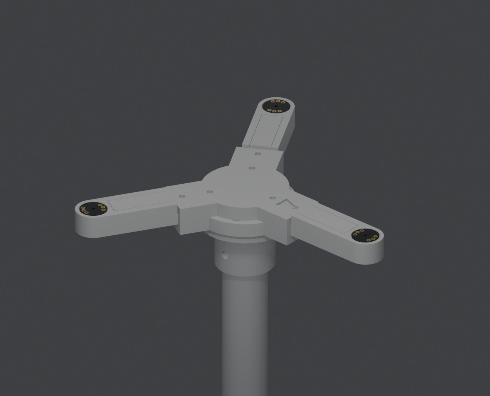
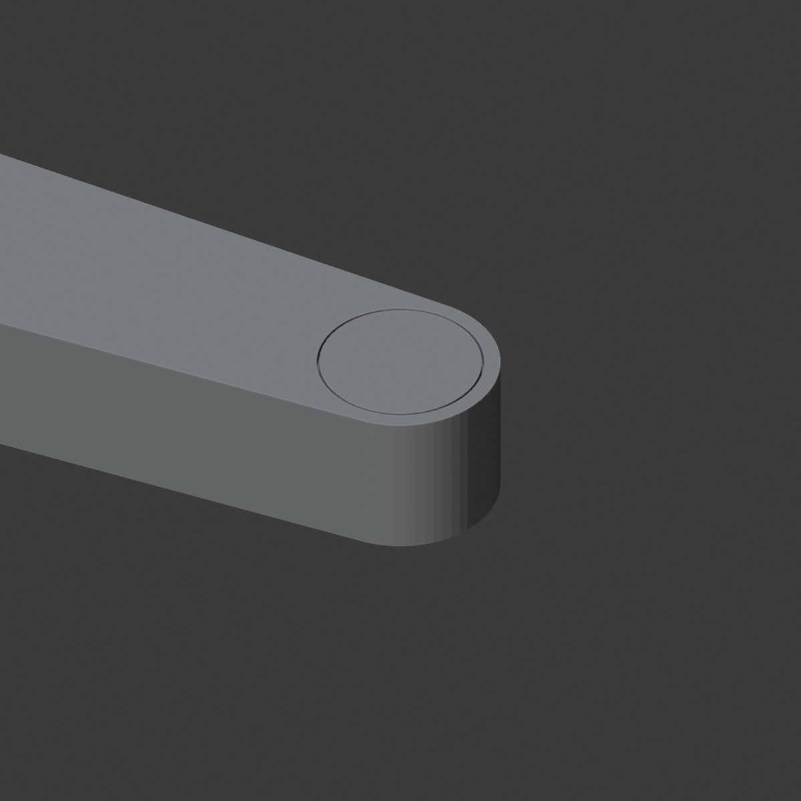

# Acoustic UAV Detector

A passive acoustic drone detector. Three digital MEMS microphones, placed at the
vertices of an equilateral triangle, listen for propeller noise; the
microcontroller measures how much earlier the sound reached each microphone
(TDOA, via GCC-PHAT) and turns those differences into an azimuth — the bearing
to the source over a full 360°.

The device emits nothing: it only listens. That means it works without GNSS and
without radio — including where the RF spectrum is jammed — and needs no
transmit permit.

This is a learning prototype. First a breadboard build that records 3-channel
audio to microSD for offline analysis, then real-time azimuth estimation on the
device, and only after that a weatherized enclosure for outdoor battery
operation.

What it cannot do: range is modest (hundreds of meters, depending on background
noise and drone type), wind and urban noise degrade accuracy, and a flat
three-microphone array yields azimuth only — no elevation.

## The whole thing on one page

Everything the build needs is on this one sheet: the signal chain down the left,
the board footprints and the head assembly across the top right, and the array
geometry — triangle and edge-on view — along the bottom right. The sections below
just read it out in words.

## How it is wired

An I2S bus carries two channels, so three microphones need both of the chip's I2S
controllers. The important part of the design is that only **one** of them
generates the clock. The clock pair — SCK (bit clock) and WS (which channel is on
the wire) — leaves the first controller, runs as a shared bus to all three
microphones, and also feeds back into the second controller, which is configured
as a slave and generates nothing.

Only the data lines are separate: `SD_A` brings back microphones M1 and M2 as one
stereo stream, `SD_B` brings back M3 on its own. The card sits on SPI at 3.3 V.

The point of the single clock is that every microphone samples on the same clock
edge, so the three streams cannot drift apart — which is exactly what would
happen with two independent clocks. What can still differ is the instant each
receive buffer starts filling, and that appears as a fixed offset of a whole
number of samples between the two data lines. A fixed offset is harmless: measure
it once, subtract it forever. Proving that it really is fixed — the same after
every reboot, stable over a long recording — is the first milestone of the build.

## The array

Three microphones on an equilateral triangle with 150 mm sides: M1 at the apex,
M2 and M3 at the base, and the centroid marked in the middle. Each microphone is
86.6 mm from the centre. Bearings are reported relative to M1, so whichever frame
is built, the M1 corner has to be marked physically and its real-world heading
noted when the array is set up — otherwise an azimuth means nothing.

There are two ways to hold the microphones in that shape. One is a solid flat
plate with the microphones at its corners: simple and rigid, but the plate is a
reflecting surface directly under the capsules and it catches wind. The other is
a three-armed frame. Both put the microphones in identical positions, so this is
a construction choice, not a change to the algorithm.

The three-armed frame won, and it is now designed and modelled — see
[The printed frame](#the-printed-frame) below. All three capsules sit on one
horizontal plane and everything solid hangs below them, out of the acoustic
path; the frame also offers the wind far less to push against.

The electronics live in a separate box that stands next to the array rather than
hanging under the hub, so the frame carries nothing but itself.

## The printed frame

Three identical arms bolt into a two-plate hub; the hub clamps onto a bought tube
that stands in a printed tripod foot. Everything is PETG, printed without
supports. STL files are in [`hardware/`](hardware/).

### What accuracy is actually needed

This is the number that drove every decision. For a baseline `b`, an error `δ` in
a microphone's position produces a bearing error of roughly `δ / b`. With
`b = 150 mm`, **1 mm of geometric error costs 0.38° of azimuth.**

That is worth comparing against what the timing side can resolve. One sample at
48 kHz is 20.8 µs, which is 7.1 mm of sound travel; GCC-PHAT with sub-sample
interpolation reaches roughly a tenth of that, so about 0.7 mm equivalent. So the
target for the frame is **~1 mm** — tighter is wasted effort because it drowns in
correlation noise, looser becomes the dominant error term.

A second, easier rule falls out of the same maths: errors that are *identical on
all three channels* do not turn into bearing error at all. Thermal expansion of
the arms (0.18 mm over 86.6 mm for a 30 °C swing) is common to all three and
cancels. This is why the three arms are printed from one file, in one batch, and
why the cable should be routed the same way on each arm even though M3 needs a
different bundle.

### Arms do not flex — joints slip

The obvious worry with a three-armed frame is that thin arms bend, and bending is
geometric error. Run the numbers for a PETG channel section 20 × 12.5 mm with a
2.5 mm wall, cantilevered 86.6 mm:

| Load | Tip deflection |
|---|---|
| Microphone + windscreen (5 g) | 0.001 mm |
| The arm's own weight (12 g) | 0.001 mm |
| 20 m/s wind on a Ø40 mm windscreen (0.15 N) | 0.005 mm |

Two to three orders of magnitude below the 1 mm that matters. Beam stiffness is
a non-issue at this scale; the whole error budget lives in the **joints** and in
**how the microphone board is seated**. So the arms are kept light and the joints
are over-built, not the other way round.

### The joint

Each arm ends in a flat tab, 20 × 6 × 28 mm, clamped between two hub plates. The
tab drops into a 3 mm pocket milled into each plate (0.15 mm clearance per side);
the inner end of the pocket is a hard face that the tab butts against, and *that*
is what sets the 86.6 mm radius — not the bolt holes, which have clearance and
would let the arm creep. Two M3 bolts per arm clamp through into hex nut pockets.

A socket-and-tongue hub was tried first and dropped. Three sockets radiating at
120° cannot all be vertical in any print orientation, so each would need a 16 mm
bridged ceiling — and that rough bridged surface would have become the datum
setting capsule coplanarity. Two flat plates print with no overhangs at all.

The M1 heading is engraved into the top plate. Without a physical mark an azimuth
means nothing.

### The microphone seat

The INMP441 breakout is a 13 mm round board, 1 mm thick. Two properties of it
shape the tip:

- The acoustic port is **central**. The MEMS die is bottom-ported and the PCB is
  drilled through beneath it, so the hole sits on the board's axis. Board rotation
  therefore does not move the acoustic point — one less thing to control.
- Sound enters from the **bare face**, opposite the chip. The board must be
  mounted chip-down, bare face to the sky, or the port is sealed. Do not fit the
  supplied headers; solder wires directly to the pads from the chip side.

The tip has a Ø13.4 × 1.0 mm recess so the board sits flush with the arm's top
face — flush, not sunk, because a cavity above the port is a Helmholtz resonator
and a resonator is a phase shift, which reads as a fake delay. The recess wall
centres the board mechanically, which is where the 1 mm budget is actually spent.

Below it is a Ø12 × 5 mm clearance cavity. It is that wide because the six pads
are spread near the board's rim, at roughly R5–6.5 mm; a narrower cavity would
have left the solder joints resting on the seat. The remaining ledge is 0.7 mm
wide, at R6.0–6.7. A side slot carries the wires into the arm's channel and vents
the cavity so it is not a sealed pressure chamber.

Rain is unresolved. The port faces up, which is right for a source overhead and
wrong for weather. A hydrophobic PTFE membrane under the board is the standard
answer — it adds a phase shift, but an identical one on all three channels, so it
is common-mode and harmless.

### The mast

The mast is a **bought Ø25 mm tube**, held by two printed clamps with pinch
slots. It is not printed, for two reasons. An aluminium tube of Ø25 × 1.5 mm has
`EI ≈ 5.4·10⁸ N·mm²` against `3.5·10⁷` for a printed PETG mast of the same
diameter — roughly **15× stiffer**. And a 200 mm printed tower is a four-hour
single-column print that can fail at any point in it, whereas the two clamps are
32 mm tall.

Aluminium is the best choice, PVC conduit the cheapest, acrylic acceptable but
brittle — do not overtighten a pinch clamp on acrylic. Inner diameter must be at
least 18 mm; the cable runs down inside the tube and exits under the foot.

Tube length is free. With 300 mm, the acoustic plane sits 328 mm above ground.

The tripod is deliberately light, and that has a cost worth knowing. The
overturning lever arm of a tripod is not the foot radius but half of it, because
it tips over the line joining two feet — about 53 mm here. Against a total mass
near 260 g, wind starts to overturn the stand at roughly **10 m/s**. The three
feet have Ø5 mm holes for ground pegs; outdoors, use them.

### Parts and hardware

| STL | Qty | Mass | Size (mm) |
|---|---|---|---|
| `arm.stl` | 3 | 11.3 g | 80.6 × 20 × 12.5 |
| `hub_top.stl` | 1 | 26.4 g | 73.5 × 84.9 × 8 |
| `hub_bottom.stl` | 1 | 26.2 g | 73.5 × 84.9 × 8 |
| `tube_collar_top.stl` | 1 | 26.9 g | 54.5 × 52 × 31 |
| `tube_foot.stl` | 1 | 52.2 g | 176 × 203 × 32 |

166 g of PETG in total, plus the tube.

- 6 × M3×16 + 6 nuts — arms to hub
- 3 × M4×12 + 3 nuts — hub to tube clamp
- 2 × M4×20 + 2 nuts — the two pinch clamps

No heat-set inserts anywhere: every bolt lands in a hex nut pocket, which is
both cheaper and stronger in PETG than an insert.

### Printing

PETG, chosen over PLA for outdoor service — PLA softens near 60 °C, which a dark
part in the sun will reach, and its creep under sustained load is exactly the
slow geometric drift this instrument cannot tolerate.

0.2 mm layers, 4 perimeters, 30 % gyroid infill. Every STL is saved in its print
orientation — drop it on the bed as-is, and **no part needs support material.**

The arm is the one that has to be printed the right way up, tab down. Inverted it
looks tempting, because the microphone seat would then face the bed and come out
flatter — but the root tab ends up floating 6.5 mm above the bed over a 28 × 20 mm
area, and that is a support block you then have to dig out of PETG. Printed the
right way up, the tab and the side walls sit flat on the bed.

That leaves exactly one overhang: the ceiling of the cable channel, a 15 mm span.
It is a **bridge, not a support** — the extruder pulls it between two walls, no
material is deposited underneath, and the surface it produces is the inside of a
cable trough where nobody cares. Use a brim; bed contact is only about 890 mm².

If you would rather not bridge at all, `arm_lid.stl` + `arm_body.stl` are the same
arm split along the channel ceiling — print both flat, glue together.

The split plane is horizontal, running along the arm, and that is deliberate. A
glue line has an uncontrolled thickness of a tenth of a millimetre or so; lying
this way it adds that error to the arm's *height*, where nothing depends on it.
Split across the arm instead and the same error would land straight on the
86.6 mm radius, which is the one dimension the whole instrument is built around.

The lid carries a locating tongue (0.3 mm clearance per side) that drops into the
channel, so it cannot be glued crooked. Bond area is roughly 270 mm² — vastly more
than the 0.005 mm-deflection loads need.

Print all three arms together, from the same file and spool, so their errors stay
common-mode.

### Still open

Windscreens are not designed in yet. The tip is a Ø16 rounded boss, so a foam
ball with a matching bore pushes straight on; a retaining feature can be added
once the actual foam is in hand.

## Components

### Microcontroller

A devkit board built around the ESP-WROOM-32 module: 30 pins, USB-C for power
and flashing. The brain of the device — it reads the microphones, runs the
correlation math, and writes results to the card.

The critical property is that the chip has **two** independent I2S controllers,
which is what makes three microphones possible at all — see the wiring section
above for how they share a clock.

Quantity: 1.

### Microphones

INMP441 — a digital MEMS microphone with an I2S output, on a round breakout
board (headers included, not yet soldered). A digital output means there is no
analog signal on the run from microphone to board that stray pickup could
corrupt — that is the main reason to choose this part over an analog capsule
plus preamp.

Supply is strictly 3.3 V; 5 V will destroy the module. The L/R pin selects which
slot of the stereo stream the microphone drives its data into: tied to GND it is
the left channel, tied to 3V3 the right. That is exactly how two microphones
share one I2S bus.

Quantity: 3 (one per triangle vertex, baseline about 15 cm).

### microSD module

A microSD card holder with an SPI interface (GND, MISO, SCK, MOSI, CS, power).
It stores raw 3-channel recordings (WAV) plus a log of detections and azimuths.
The recordings matter mostly for debugging the algorithm offline on a computer:
tuning filter and correlation parameters in Python against a saved file is far
easier than reflashing the board on every iteration.

This is the compact variant, with neither an onboard regulator nor a level
shifter, so it runs directly on 3.3 V — the same rail as the microphones. (The
larger modules, the ones carrying an LDO, are what expect 5 V; this is not one of
those.)

Quantity: 1 (plus the card itself).

### Rest of the build

- A rigid frame for the array — designed and modelled, see
  [The printed frame](#the-printed-frame). Vertices are held to about 1 mm,
  because geometric error maps directly onto azimuth error.
- A Ø25 mm tube for the mast (aluminium, PVC or acrylic), cut to the height you
  want, plus three ground pegs.
- Foam windscreens for every microphone: wind is the main TDOA killer outdoors.
- Protoboard, wire, passives. Keep I2S runs short (10–15 cm); for spatially
  separated microphones use twisted pairs or shielded cable.
- Power: USB-C 5 V on the bench; for the field, an 18650 with a protection board
  and 3.3 V / 5 V regulation.
- Later: a weatherized (IP-rated) enclosure, and rain protection for the
  upward-facing microphone ports.

## Project status

Components are in hand, the wiring and array layouts are drawn, and the array
frame is fully modelled and exported for printing — nothing on the mechanical
side is blocking now. Assembly has not started.

Next step is bringing up capture on both I2S controllers and **proving** that the
offset between the two data lines is a constant. This gates everything else:
without confirmed synchronization, direction estimation is meaningless.

The test for it is simple. Put an impulse source — a clap, or a click from a small
speaker — directly above the centroid, equally distant from all three microphones.
The true time difference is then zero for every pair, so whatever delay the
correlation reports is the buffer offset itself, and it can be measured, repeated
across reboots, and watched for drift.
