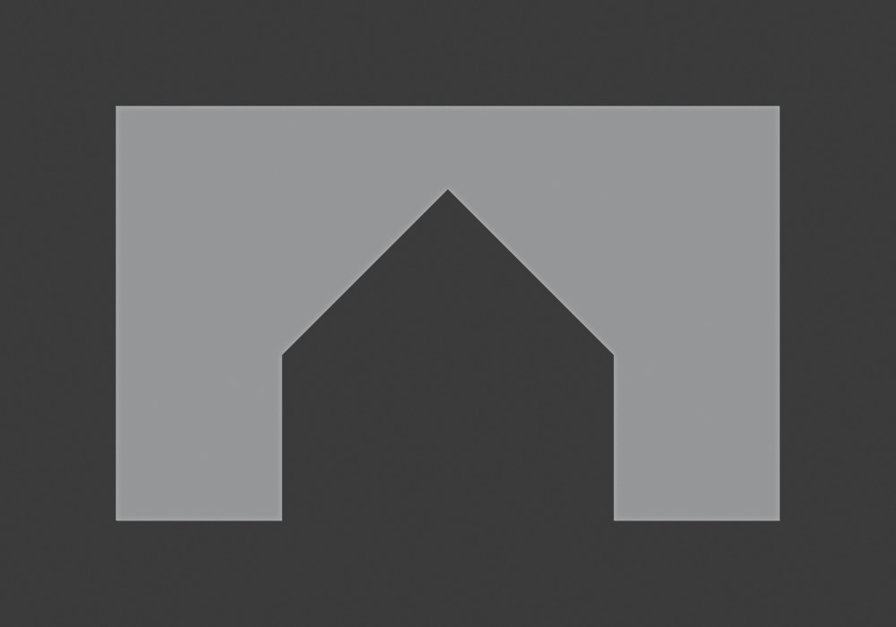
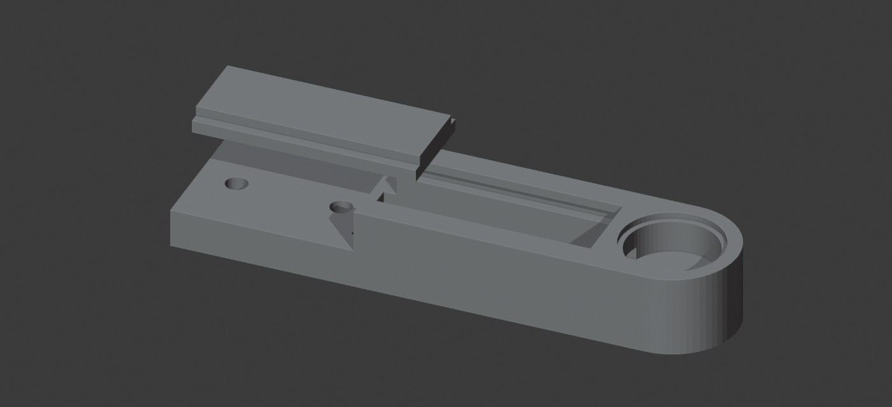
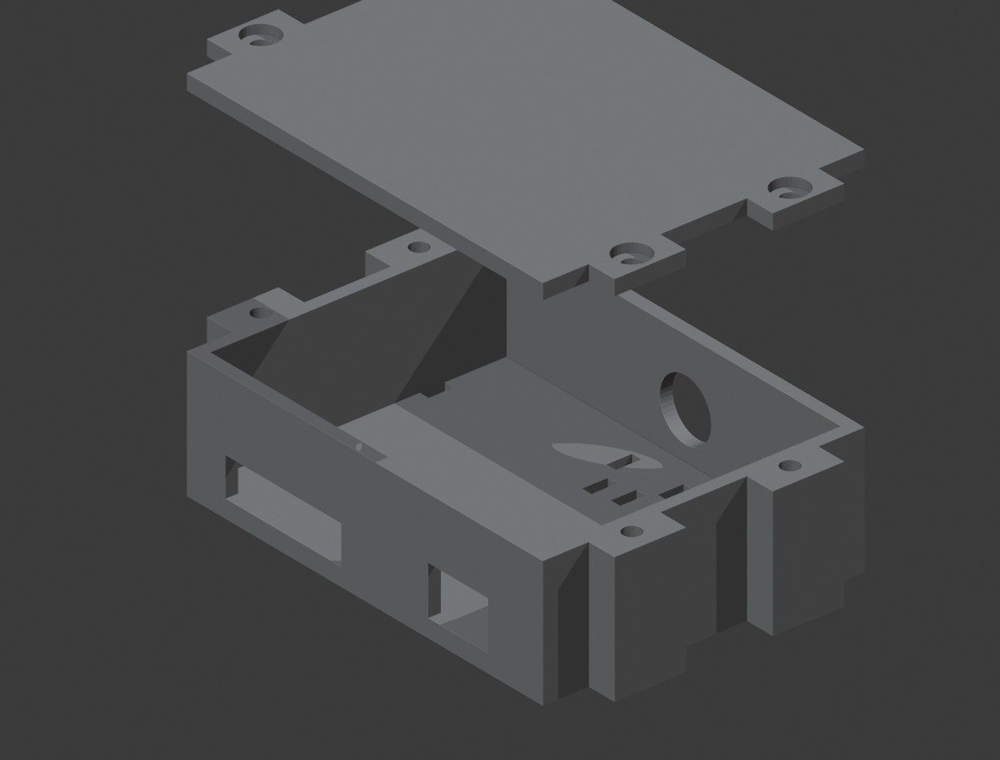

# Acoustic UAV Detector

A passive acoustic drone detector. Three MEMS microphones on an equilateral
triangle listen for propeller noise. An ESP32 measures the time differences of
arrival between them (GCC-PHAT) and turns them into a bearing over 360°.

It only listens, so it works without GNSS or radio, including where RF is
jammed, and needs no transmit permit. Limits: range is hundreds of metres at
best, wind and urban noise hurt, and a flat three-mic array gives azimuth plus
only a rough elevation that can't tell above the horizon from below.

What's here:

- [`firmware/`](firmware/): ESP-IDF (C++17, FreeRTOS) for ESP32 / ESP32-S3.
  Dual-I2S capture on one clock, GCC-PHAT on the chip, bearings out over UART,
  raw audio to microSD.
- [`analysis/`](analysis/): Python reference of the same DSP, a simulator, the
  clock-offset click test, accuracy vs the Cramér–Rao bound, multi-node fusion,
  and a bridge to ATAK (Cursor-on-Target).
- [`hardware/`](hardware/): STL files for the printed array frame and the
  electronics box.
- [`docs/RESEARCH.md`](docs/RESEARCH.md): notes on existing systems, datasets,
  and why ESP-IDF rather than Arduino or Rust.

## Schematic


The hand-drawn sheet has the signal chain, board footprints, the head assembly
and the array geometry. A few things on it are out of date: M3 is labelled
`SD_A` but sits on `SD_B`, the MCU is drawn as an ESP32-S3 while the bench uses
an ESP32 DevKit V1 (WROOM-32), and the electronics box is drawn under the hub
but ended up as a separate box next to the tripod.

## Wiring

One I2S bus carries two channels, so three mics need both of the chip's I2S
controllers. Only I2S0 generates the clock. SCK and WS go to all three mics and
back into I2S1, which runs as a slave. `SD_A` carries M1 + M2 as one stereo
stream, `SD_B` carries M3.

Pins on the DevKit V1, as wired on the bench:

| Signal | GPIO | Notes |
|---|---|---|
| SCK | 26 | I2S0 out, to all mics |
| WS | 25 | I2S0 out, to all mics |
| `SD_A` (M1 + M2) | 33 | I2S0 data in |
| `SD_B` (M3) | 32 | I2S1 data in |
| SCK return | 14 | I2S1 clock in, jumpered from SCK |
| WS return | 27 | I2S1 WS in, jumpered from WS |
| SD card SCK / MISO / MOSI / CS | 18 / 19 / 23 / 5 | VSPI, 3.3 V |

L/R straps: M1 to GND (left), M2 to 3V3 (right), M3 to GND (alone on its line).
Every VDD goes to 3.3 V. An unpowered INMP441 doesn't just go quiet: its
protection diodes clamp the shared data line and the whole line reads zero.

With one clock, all mics sample on the same edge, so the streams can't drift.
The two receive buffers can still start filling at slightly different moments,
which gives a constant whole-sample offset between `SD_A` and `SD_B`. That's
fine as long as it really is constant, so the first job on hardware is proving
it (see [Status](#status)).

## Array and frame

Equilateral triangle, 150 mm sides, M1 at the apex, M2 bottom-left, M3
bottom-right, each 86.6 mm from the centre. Bearings are measured clockwise
from M1, so the M1 arm is engraved on the hub and its real heading has to be
noted when the array is set up.


I went with three arms on a hub rather than a flat plate: less surface under
the capsules to reflect sound, less wind load, and everything solid sits below
the microphone plane. PETG, no supports.


### Accuracy target

A position error δ on one mic costs about δ / 150 mm of bearing, so 1 mm is
0.38°. One sample at 48 kHz is 7.1 mm of sound travel, and sub-sample
interpolation gets to roughly a tenth of that. So the frame is built to about
1 mm; tighter would be lost in correlation noise.

Errors that are the same on all three channels (thermal expansion, a membrane
over every port) cancel out. That's why the three arms come from one file,
one batch, one spool, and are wired the same way.

### Arms and joint

A 20 × 12.5 mm PETG channel cantilevered 86.6 mm deflects about 0.005 mm under
a 20 m/s gust on a Ø40 windscreen, so stiffness isn't the issue. The error
budget is in the joints and in how the board sits.

Each arm ends in a 20 × 6 × 28 mm tab clamped between two hub plates. The tab
butts against the end of a 3 mm pocket, and that face sets the 86.6 mm radius,
not the bolts. I tried a socket hub first, but three radial sockets can't all
print upright, and the bridged surface would have ended up as the coplanarity
datum.

### Microphone seat


The INMP441 breakout is a 15 mm round board (the first print was for 13 mm and
didn't fit). The port is central and bottom-ported, so sound enters from the
bare face and the board goes chip-down, bare face up. Rotation doesn't matter.

- Ø15.6 × 1.0 mm recess, board flush with the top face. A cavity above the port
  would resonate and add phase, which reads as delay. The recess wall centres
  the board; 0.3 mm of clearance costs about 0.1°.
- Ø14 clearance cavity below, total pocket depth 9.5 mm. With headers fitted the
  board plus pins is about 9 mm, and the extra 0.5 mm makes sure the board rests
  on its ledge and not on its pin tips.
- A side tunnel takes the wires into the arm channel and vents the cavity.
- A Ø10 hole through the floor lets you push the board out with a rod, and
  drains water.

The recess is what set the tip at Ø20 and the arm at 20 mm wide. Rain is still
open; a PTFE membrane under the board would add the same phase on all three
channels, so it's harmless.

### Cable route


Five wires per mic (VDD, GND, SD, SCK, WS) go from the cavity through a
5 × 2.75 mm tunnel, along the arm channel, under the tab through a 6 mm groove,
along the lower hub plate and down the Ø16 hole into the tube. The M3 bolt
passes through the middle of the tab groove, leaving 1.3 mm each side, so push
the wires aside before tightening.

### Mast

A bought Ø25 mm tube (aluminium best, PVC cheapest) held by two printed
sockets, each with one M4 through-bolt. Drill the tube using the socket as a
jig. An aluminium tube is about 15× stiffer than a printed PETG one and
doesn't cost a four-hour print. Inner diameter at least 18 mm for the cable.
With a 300 mm tube the microphones sit 328 mm off the ground.

The tripod is light (about 260 g total) and tips at roughly 10 m/s of wind, so
use the ground pegs outdoors.

An earlier pinch-clamp socket is kept in `superseded/` but shouldn't be
printed: its clamp ears overhang with nothing under them, and supporting them
would weld the clamp shut.

### Parts

`hardware/` holds what you'd print today; replaced parts are in
`hardware/superseded/`. File names carry a version and the defining dimension.

| STL | Qty | Mass | Size (mm) |
|---|---|---|---|
| `arm_body_v4_mic15.stl` | 3 | 11.2 g | 82.6 × 20 × 12.5 |
| `arm_lid_v2_mic15_slide.stl` | 3 | 2.0 g | 34.2 × 14.6 × 3.5 |
| `hub_top_v1.stl` | 1 | 26.4 g | 73.5 × 84.9 × 8 |
| `hub_bottom_v3.stl` | 1 | 23.7 g | 73.4 × 84.6 × 8 |
| `tube_collar_top_v3.stl` | 1 | 19.2 g | 45.9 × 53 × 31 |
| `tube_foot_v2_tube25.stl` | 1 | 47.4 g | 176 × 203 × 32 |

156 g of PETG plus the tube. `arm_v4_mic15.stl` is the same arm in one piece
(no sliding lid, one extra bridge, can't be reopened); print one or the other.

Hardware:

- 3 × M3×16 + 6 nuts: arms to hub, one bolt per arm on the outer hole, nuts
  captive in the lower plate
- 3 × M3×7: the top mast fitting, screwed from below into the three inner nuts
- 1 × M4×40 + nyloc + 2 washers: through the fitting and the tube

The fitting sits on the arms' inner bolt circle (r 20) and uses their nuts, so
the plate the cable crosses has no second set of holes. One bolt per arm is
enough because the tab pocket already stops it rotating.

| Superseded | Why |
|---|---|
| `arm_v1_mic13`, `arm_body_v1_mic13`, `arm_lid_v1_mic13_glued` | built for a 13 mm board; glued lid |
| `arm_v2_mic15`, `arm_body_v2_mic15` | 6 mm pocket, too shallow with pins |
| `arm_v3_mic15`, `arm_body_v3_mic15` | gabled channel ceiling the split arm doesn't need (+2.6 g) |
| `hub_bottom_v1` | 12 mm cable tunnels |
| `hub_bottom_v2`, `tube_collar_top_v2_tube25` | separate M4 holes for the collar |
| `tube_collar_top_v1_tube25`, `tube_foot_v1_tube25` | pinch clamp with unsupported ears |

### Printing

PETG rather than PLA: PLA softens near 60 °C in the sun and creeps under load,
and creep is geometric drift. 0.2 mm layers, 4 perimeters, 30 % gyroid. Every
STL is saved in print orientation and none needs supports.

Print the arm tab-down. Upside down the seat comes out flatter, but the tab then
floats 6.5 mm above the bed and needs a support block.



Widest unsupported spans, measured from the STLs:

| Part | Span | What |
|---|---|---|
| `case_base_v2` | 14 and 27 mm | the USB and SD window lintels (2.5 mm deep) |
| `hub_top_v1` | 8.9 mm | the engraved M1 arrow, facing the bed |
| `arm_body_v4` | 6 mm | cable groove under the tab |
| `hub_bottom_v3` | 6 mm | cable tunnels |
| `arm_body_v4` | 5 mm / 1.5 mm | cable tunnel / lid undercut |
| tube fittings | under 1 mm | crowns of the sideways M4 holes (ream if tight) |
| `arm_lid_v2`, `case_clamp_v2` | none | |

PETG bridges these fine with the fan on. Use a brim.

The arm body and lid need no glue or screws: the lid is a T-bar that slides into
a T-slot from the root end until it stops at the tip block, and the hub's top
plate then covers its end so it can't slide back out. Slide it out to rework a
wire. Print the lid flange-down.



| Lid detail | |
|---|---|
| Flange | 14.6 × 1.95 mm |
| Rib | 11.6 × 1.55 mm, flush with the top |
| Retaining lip | 1.4 mm thick, 1.5 mm reach (0.8 mm was easy to snap off) |
| Clearance | 0.20 mm per side, 0.15 mm vertical |
| Travel | 34.6 mm |

Windscreens aren't designed yet. The tip is a Ø20 rounded boss, so a foam ball
with a matching bore pushes on.

## Electronics box


A separate box on the ground next to the tripod holds the ESP32 and the SD
module, so nothing in it affects the geometry.



Neither board has reliable dimensions. The DevKit V1 is
[documented at 51.8 × 28.2 mm](https://mischianti.org/doit-esp32-dev-kit-v1-high-resolution-pinout-and-specs/)
and measures 50 × 28; the SD module is
[listed at 50 × 33](https://arduino.ua/prod589-modyl-sd-card-dlya-arduino-spi),
measures 46 × 29, and other sellers quote anything from 41 × 24 to 53 × 38. So
the bays fit the largest plausible board and the boards are clamped rather than
press-fitted.

The ESP32's header pins stick out 3 mm underneath along both long edges, so it
can't sit on the floor or on its edges. Each board sits on four Ø9 × 4 mm pads
in the middle. A fixed lip holds one edge and a sliding clamp
(`case_clamp_v2.stl`, one M3 in a T-slot, 12 mm travel) holds the other.

| Opening | Size | Where |
|---|---|---|
| USB-C | 14 × 10 mm | short wall, ESP32 bay |
| SD card | 27 × 10 mm | short wall, SD bay |
| Cable entry | Ø12 mm | opposite wall |

Seven wires come in from the array: VDD, GND, SCK, WS and the three mic data
lines. Nothing is weatherproof yet.

| STL | Qty | Mass | Size (mm) |
|---|---|---|---|
| `case_base_v2_63x108.stl` | 1 | 70.7 g | 63 × 108 × 27 |
| `case_lid_v2_63x108.stl` | 1 | 25.3 g | 63 × 108 × 5 |
| `case_clamp_v2.stl` | 2 | 2.5 g | 25 × 12 × 10 |

101 g of PETG. 4 × M3×30 + nuts for the lid (nuts sit flush in hex pockets
under the bosses), 2 × M3×16 + nuts for the clamps. Base prints floor-down, lid
top-down, clamp lip-down. The v1 box had no board mounting and a floor too thin
for captive nuts.

One conflict I haven't resolved: with the box next to the tripod, the I2S lines
run down the mast, well past the 10–15 cm the INMP441 is comfortable with. It
worked on the bench; outdoors it will need twisted pairs or shielded cable, or
the electronics moving up under the hub.

## Components

- **ESP32 DevKit V1** (ESP-WROOM-32, 30 pins). It has two I2S controllers, which
  is what makes three mics possible.
- **3 × INMP441**, digital I2S MEMS mics on 15 mm round boards, 3.3 V only.
  Digital output means no analog run for noise to get into.
- **microSD module**, SPI, the compact kind with no regulator or level shifter,
  so 3.3 V only.
- Ø25 mm tube, ground pegs, foam windscreens, wire.
- Power: USB on the bench; an 18650 with protection and regulation for the field.

## Software


Every 21 ms the firmware reads 1024 samples per mic, removes the fixed offset
between the two data lines, and hands the frame to a DSP task on the other core.
That task keeps the 200–4000 Hz FFT bins (where propeller and engine harmonics
are and most wind isn't) and accumulates the three cross-spectra. Every 256 ms
it runs GCC-PHAT per pair and solves for the bearing.

Averaging the cross-spectra before PHAT is what makes it hold up in wind: a
harmonic adds up coherently, while wind is local turbulence at each port and
averages out. A detection needs band energy over an adaptive noise floor, a
tonal spectrum, and coherence between mics, and the three pair delays must be
consistent (τ₀₁ + τ₁₂ − τ₀₂ ≈ 0). The output is one line per block:

```
$UAVDOA,1,48213,1,62.4,152.4,18.7,0.83,11.2,0.71,1,151.9*38
        node time det az_rel az_true el conf snr coh track track_az
```

In simulation (plot above) the bearing is better than 1° above about 8 dB of
in-band SNR, and below the 1 mm geometry error above about 15 dB. Wind as loud
as the drone adds 25–35 % error. The pipeline is 5–10× above the Cramér–Rao
bound; part of that is the bound's flat-spectrum assumption, part is PHAT
weighting noisy bins equally, so an SNR-weighted GCC is the next thing to try.

| Error source | Azimuth |
|---|---|
| 1 mm mic position | 0.38° |
| 1 sample of timing | 2.7° |
| 0.1 sample (after interpolation) | 0.27° |
| Speed of sound ±5 % | ~0° (cancels), biases elevation |
| M1 heading error | 1:1 |


With two or more nodes the bearings cross and give a position.
`analysis/uavdoa/fusion.py` does weighted least squares and returns an error
ellipse, which stretches when the nodes see the target from similar angles.
`analysis/scripts/cot_bridge.py` publishes nodes and fixes as Cursor-on-Target
so they show up in ATAK. Fixes are typed "unknown air", not hostile.

Build, config and bring-up steps are in [`firmware/README.md`](firmware/README.md).
CI runs the host C++ tests, the Python tests (including a check that C++ and
Python give the same result on the same recording), the click test on synthetic
data, and firmware builds for both chips.

## Status

The frame is printed and assembled. In September 2026 all three mics and the
SD card ran together on the bench, using quick MicroPython tests:


- M1 + M2 came through as one stereo stream on `SD_A`, so the L/R straps work.
- M3 came through on `SD_B` (silent at first because its VDD wasn't connected).
- The SD card mounted, wrote and read back.

MicroPython's I2S is master-only, so in that test I2S1 made its own clock and
fed M3 from GPIO 14/27. Good enough to see the mics alive, useless for TDOA
because the streams aren't sample-locked.

The bench and those scripts aren't accessible any more. The firmware here is a
fresh ESP-IDF implementation of the full design, with I2S1 as a real slave. It
builds for both chips and the DSP is tested against the Python reference, but
it hasn't run on the hardware yet. Next steps once the bench is back:

1. Move M3's SCK/WS onto the shared bus, keep the 14/27 return jumpers.
2. Click test: a click source above the centroid, where the true delay is zero
   for every pair, so whatever the correlation reports is the buffer offset.
   Record across a dozen reboots and run `analysis/scripts/click_test.py`; it
   checks the offset is an integer, the same every boot, and doesn't drift,
   then prints the value to configure. Nothing else matters until this passes.
3. Field recordings of real drones to tune the detector (there's no public
   Shahed or FPV audio).
4. SNR-weighted GCC; a small on-device classifier; time sync between nodes
   without GNSS; windscreens and an IP enclosure.
