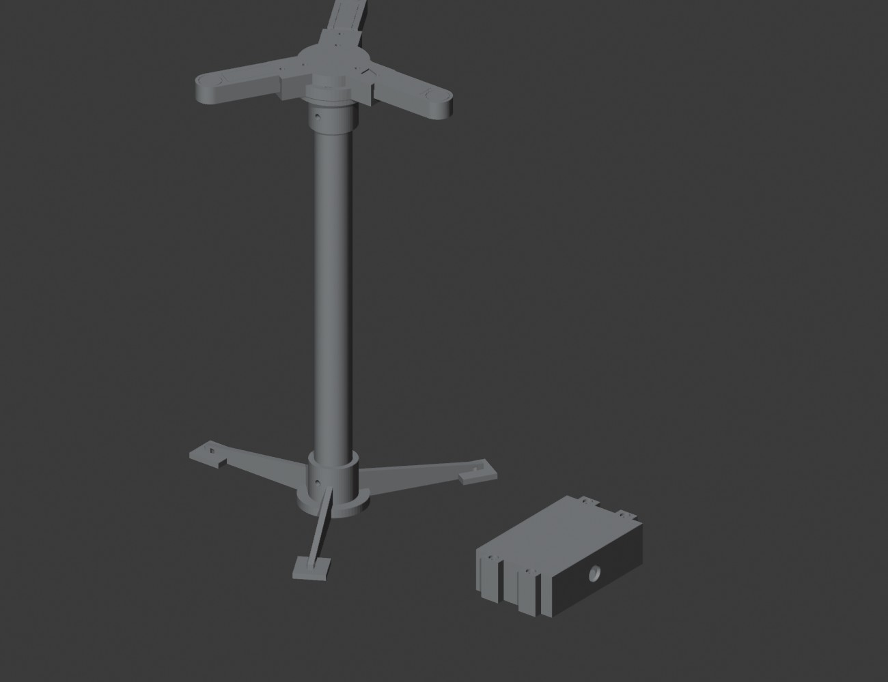
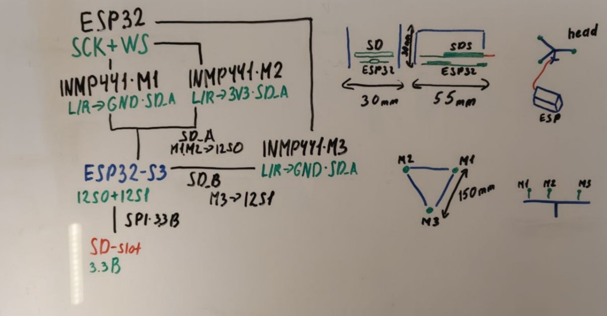
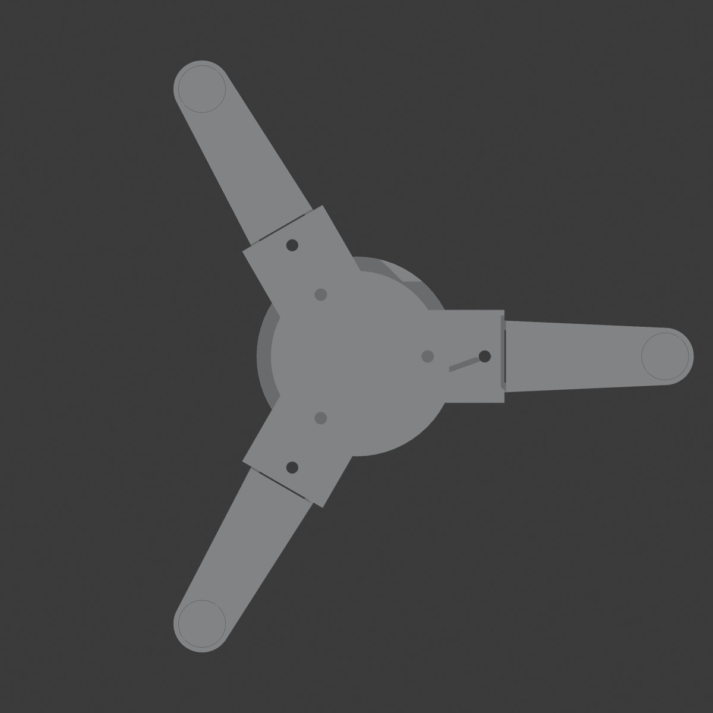
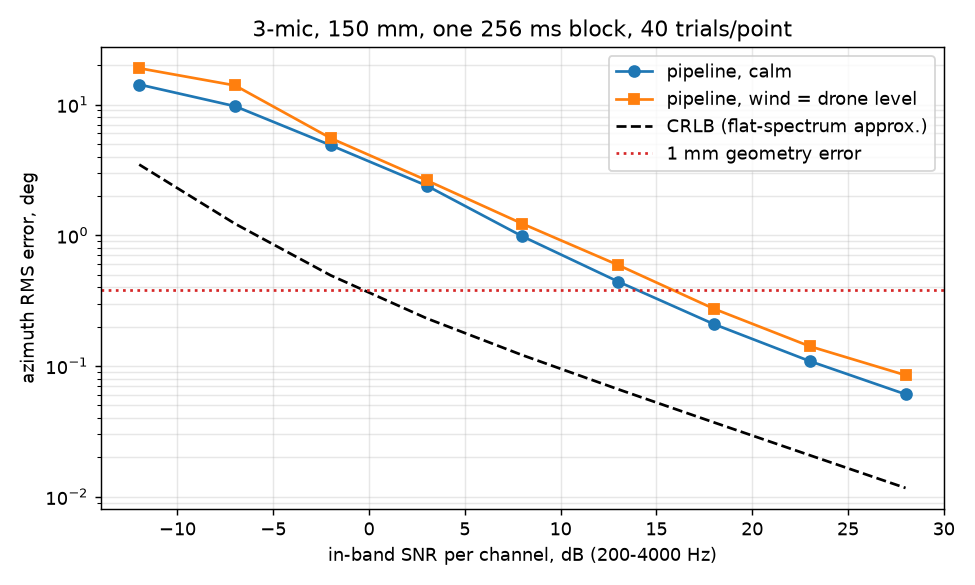
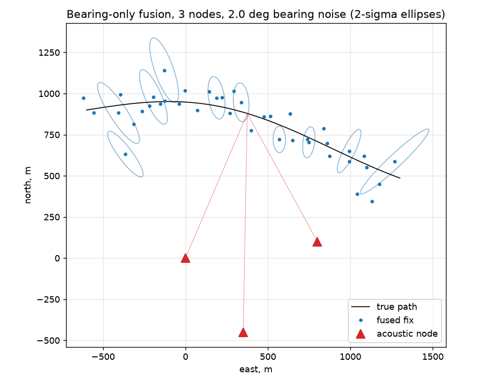
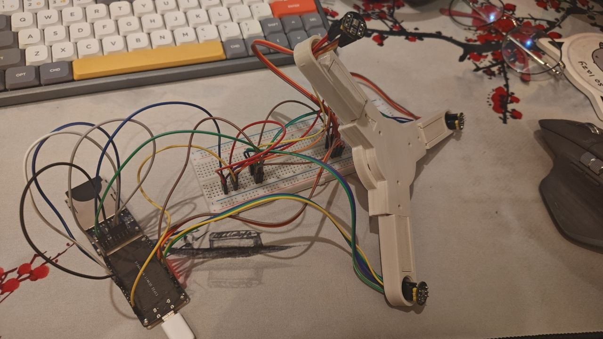

# Acoustic UAV Detector

[](https://github.com/IllyaMoore/Acoustic-UAV-detector/actions/workflows/ci.yml)

A passive acoustic drone detector: three MEMS microphones on a 150 mm triangle
and an ESP32 that estimates the bearing to a drone from propeller noise
(TDOA, GCC-PHAT), over 360°. Several nodes can be fused into a position and
shown in ATAK.

It emits nothing, so it works without GNSS or radio, including under jamming,
and needs no transmit permit.



## What's here

- [`firmware/`](firmware/): ESP-IDF, C++17, FreeRTOS, for ESP32 / ESP32-S3.
  Dual-I2S capture on one clock, GCC-PHAT on the chip, bearings out as
  NMEA-style lines, raw audio to microSD.
- [`analysis/`](analysis/): Python reference of the same DSP, a simulator, the
  clock-offset test, accuracy vs the Cramér–Rao bound, multi-node fusion, and a
  Cursor-on-Target bridge for ATAK.
- [`hardware/`](hardware/): the printed array frame and electronics box.
- [`docs/RESEARCH.md`](docs/RESEARCH.md): existing systems (Sky Fortress,
  Zvook, European vendors), signatures, datasets, choice of stack.

## Try it

No hardware needed for the first three.

```sh
make -C firmware/test/host test                  # C++ DSP unit tests
cd analysis && uv run pytest -q                  # Python reference + C++ parity
uv run python scripts/cot_bridge.py --demo --dry-run   # 3 simulated nodes -> CoT, Ctrl-C to stop
cd ../firmware && pio run -t upload              # flash an ESP32 DevKit
```

## How it works



**Synchronous capture.** Three mics need both of the ESP32's I2S controllers.
Only I2S0 generates the clock; I2S1 runs as a slave on the same SCK/WS. All
mics sample on the same edge, so the streams can't drift. What's left is a
constant whole-sample offset between the two controllers' buffers, which is
measured once with a click test and subtracted.

**Array.** Equilateral triangle, 150 mm sides, bearings measured clockwise from
M1. 1 mm of mic position error costs 0.38° and one sample of timing (7.1 mm)
costs 2.7°, so the frame is built to about 1 mm and the DSP interpolates to
about a tenth of a sample.



**Signal chain.** Every 21 ms the firmware reads 1024 samples per mic and
aligns them. A DSP task on the second core keeps the 200–4000 Hz bins, where
propeller and engine harmonics are and most wind isn't, and accumulates the
cross-spectra. Every 256 ms it runs GCC-PHAT per pair and solves for the
bearing. Averaging before PHAT is what holds up in wind: harmonics add
coherently, wind is local turbulence at each port and averages out.

A detection needs band energy above an adaptive noise floor, a tonal spectrum,
coherence between mics, and consistent pair delays (τ₀₁ + τ₁₂ − τ₀₂ ≈ 0).
Output, one line per block:

```
$UAVDOA,1,48213,1,62.4,152.4,18.7,0.83,11.2,0.71,1,151.9*38
        node time det az_rel az_true el conf snr coh track track_az
```

## Results (simulation)



- Bearing error under 1° above ~8 dB in-band SNR, under the 1 mm geometry
  error above ~15 dB.
- Wind as loud as the drone adds 25–35 % error.
- 5–10× above the Cramér–Rao bound. Part is the bound's flat-spectrum
  assumption, part is PHAT weighting noisy bins equally; an SNR-weighted GCC
  is the next step.

## Networked use



One node gives a bearing; two or more give a position.
`analysis/uavdoa/fusion.py` does weighted least squares with an error ellipse,
which stretches when nodes see the target from similar angles.
`analysis/scripts/cot_bridge.py` publishes nodes (with bearing wedges) and fused
fixes as Cursor-on-Target on ATAK's multicast group. Fixes are typed "unknown
air": the sensor reports a sound, the operator decides what it is.

## Testing

- ~700 host unit checks on the C++ DSP.
- The C++ and the Python reference run on the same recording and must agree to
  0.02 samples.
- The click-test gate on synthetic reboots.
- Firmware builds for both chips in CI.

## Status

The frame is printed and assembled. On the bench (September 2026) all three
mics and the SD card worked together under quick MicroPython tests.



MicroPython's I2S is master-only, so those streams weren't sample-locked. The
firmware here implements the full design with I2S1 as a real slave. It is
tested in simulation but hasn't run on the hardware yet, because the bench
isn't currently accessible.

Next:

1. The click test on hardware. Confirm the offset between the two data lines
   is constant across reboots and over time. Nothing else matters until this
   passes.
2. Field recordings of real drones to tune the detector; there's no public
   Shahed or FPV audio.
3. SNR-weighted GCC, a small on-device classifier, time sync between nodes
   without GNSS, weatherproofing.

## Limits

- Range is hundreds of metres at best, depending on drone and background noise.
- Wind and urban noise degrade detection.
- A flat three-mic array gives azimuth plus only a rough elevation that can't
  tell above the horizon from below.
- Detection and bearing only. One node doesn't range; ranging needs several
  nodes.
