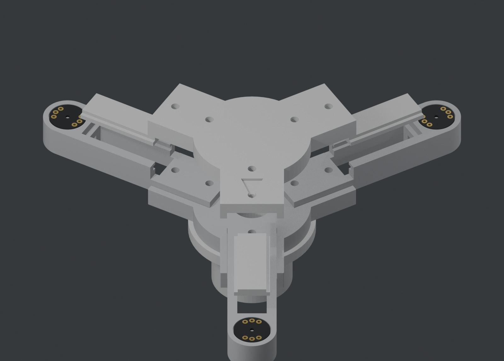
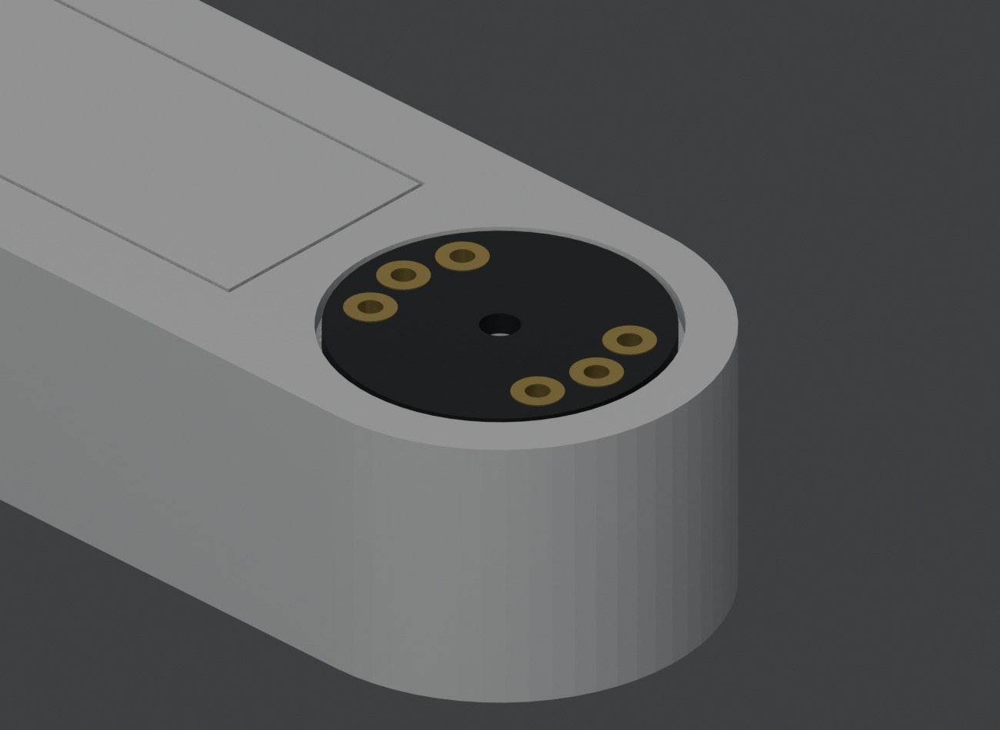

# Hardware

## Wiring (ESP32 DevKit V1, as on the bench)

| Signal | GPIO | |
|---|---|---|
| SCK | 26 | I2S0 out, to all mics |
| WS | 25 | I2S0 out, to all mics |
| `SD_A` (M1 + M2) | 33 | I2S0 data in |
| `SD_B` (M3) | 32 | I2S1 data in |
| SCK return | 14 | I2S1 clock in, jumpered from SCK |
| WS return | 27 | I2S1 WS in, jumpered from WS |
| SD card SCK / MISO / MOSI / CS | 18 / 19 / 23 / 5 | VSPI |

L/R straps: M1 to GND, M2 to 3V3, M3 to GND. Everything runs on 3.3 V. An
unpowered INMP441 clamps its data line to zero, so a dead channel usually means
a missing VDD.

## Frame

Three PETG arms on a two-plate hub, on a Ø25 mm tube. Mics sit flush in 15.6 mm
recesses at the tips, 86.6 mm from the centre, port up. Each arm's radius is set
by a hard stop in the hub pocket, not by the bolts. The M1 arm is engraved on
the hub. Print all three arms from one file and one spool so their errors are
common-mode.

| STL | Qty |
|---|---|
| `arm_body_v4_mic15.stl` + `arm_lid_v2_mic15_slide.stl` (or one-piece `arm_v4_mic15.stl`) | 3 |
| `hub_top_v1.stl`, `hub_bottom_v3.stl` | 1 each |
| `tube_collar_top_v3.stl`, `tube_foot_v2_tube25.stl` | 1 each |
| `case_base_v2_63x108.stl`, `case_lid_v2_63x108.stl` | 1 each |
| `case_clamp_v2.stl` | 2 |

Fasteners:

| Qty | Part | For |
|---|---|---|
| 3 | M3×16 + nuts | arms |
| 3 | M3×7 | mast fitting, into the arms' inner nuts |
| 1 | M4×40 + nyloc | through the tube |
| 4 | M3×30 + nuts | box lid |
| 2 | M3×16 + nuts | board clamps |

Printing: 0.2 mm layers, 4 perimeters, 30 % gyroid, no supports, STLs saved in
print orientation. The widest bridges are the box's window lintels (14 and
27 mm). Older versions are in `superseded/`; don't print them.

## Open issues

- Windscreens and rain protection for the up-facing ports aren't designed yet.
- The box stands next to the tripod, so the I2S lines are much longer than the
  10–15 cm the INMP441 likes. Outdoors that needs twisted or shielded cable, or
  the electronics moved under the hub.
